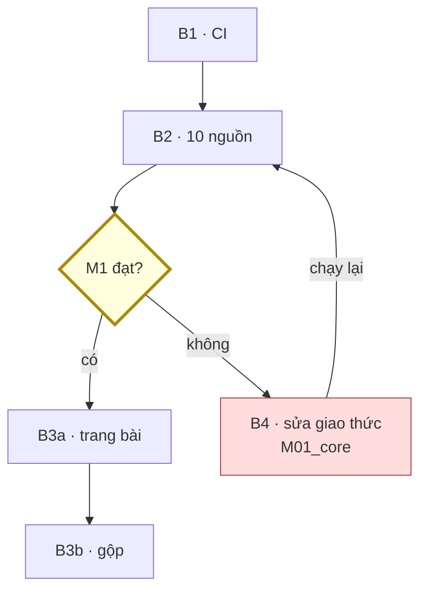
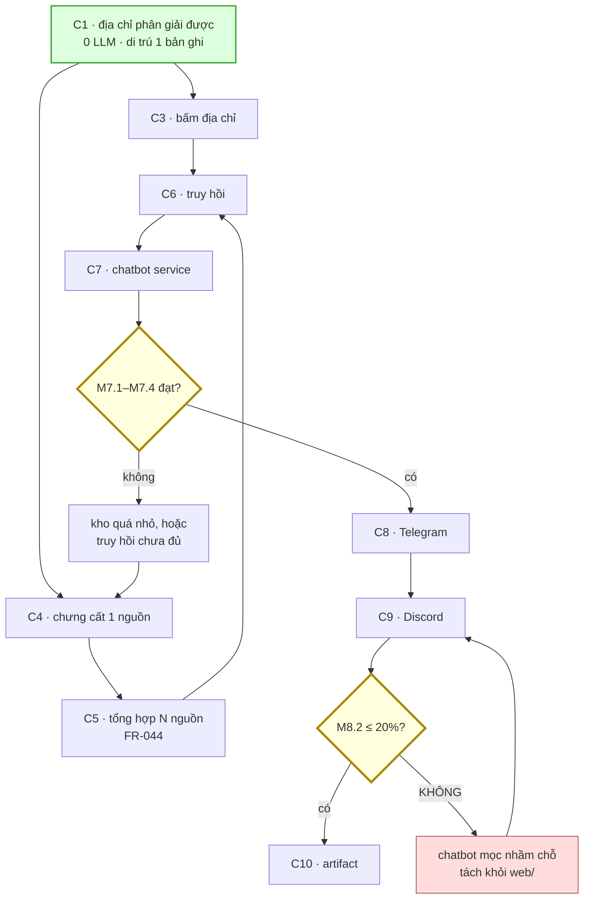

# Build order

> PM (s7) **tiêu thụ** file này, không tự bịa thứ tự.
> Thứ tự theo **rủi ro**, không theo phụ thuộc dữ liệu — vì phụ thuộc dữ liệu đã
> thoả sẵn (M02_kb không phụ thuộc ai).

## Nguyên tắc xếp

**Làm trước thứ có thể giết dự án.** Không phải làm trước thứ dễ.

M1 là metric chặn: *3/10 insight mới · 1/10 thành skill · <20 phút/bản*. Không
đạt ⇒ vấn đề ở giao thức hoặc cổng lọc, và **xây thêm hạ tầng chỉ làm scale một
thứ chưa hoạt động**. Nên thứ tự dưới đây đặt việc đo M1 lên rất sớm.

## Thứ tự

### B1 · M04_ci — CI có răng

**Vì sao trước tiên**: S3 là một trong bốn bề mặt duy nhất rule có răng. Đơn vị
việc đầu tiên chạy qua vòng lặp Factory sẽ cần bằng chứng máy xanh ở nhịp ⑤. Làm
sau thì reviewer đòi evidence mà chỉ có lời khai — R2 đánh trượt.

**Ra**: `.github/workflows/ci.yml` chạy `pytest core/tests` + `validate.py kb/`

**Kèm theo**: dọn môi trường Python phân mảnh (ADR-02) — gap đã ghi trong map.

**Xong khi**: PR chạm `core/` hoặc `kb/` bị gác; CI đỏ khi cố tình phá một luật.

**Ước**: nhỏ. Một đơn vị việc.

---

### B2 · M02_kb — nạp 10 nguồn thật, đo M1

**Vì sao thứ hai**: đây là chỗ dự án có thể chết. Mọi thứ đã dựng mới chứng minh
được là *chạy đúng*, chưa chứng minh *tạo ra giá trị*.

**Ra**: 10 file trong `kb/` (3 repo · 2 paper · 2 video · 2 blog · 1 docs), mỗi
bản có số đo thời gian duyệt và cờ `insight_new`.

**Xong khi**: đủ 10 bản, có kết luận M1 đạt hay không.

**Cổng rẽ nhánh**:
- **M1 đạt** → B3
- **M1 không đạt** → **DỪNG, không làm web.** Mở FR về giao thức: sửa cổng lọc
  Pass 4 hoặc thang kiểm chứng, rồi chạy lại 10 nguồn. Đây là đường quay lại
  s6/s7 cho `M01_core`, không phải đường đi tiếp.

**Ước**: lớn nhất về thời gian người (10 × ~20 phút duyệt + thời gian chạy).

**Lưu ý**: đây **không** phải đơn vị việc code — là việc *dùng* hệ thống. Nhưng
nó là gate thật, nên phải nằm trong build order.

---

### B3 · M03_web — trang bài trước, trang chủ sau

**Vì sao sau B2**: web chỉ có nghĩa khi có bài thật để render, và khi M1 đã chứng
minh bài đáng đọc.

Chia làm hai đơn vị việc, **không** làm cùng lúc:

**B3a · Trang bài** — Quartz + filter `approved` + render 9 mục.
Xong khi: một file `.md` thật render đẹp, `draft` không lọt.

**B3b · Trang chủ + gộp** — emitter gộp `url_normalized`, sort theo `priority`,
3 khối trang chủ.
Xong khi: 3 bản cùng URL hiển thị thành 1 bài; trang chủ không xếp theo ngày.

`web-spec.md` nói rõ: *trang chủ chỉ có nghĩa khi trên 20 bài*. Với 10 bài, B3b
làm phần gộp là đủ, phần trang chủ có thể hoãn.

**Ước**: B3a nhỏ (Quartz cho sẵn nhiều), B3b vừa (emitter gộp là phần nặng nhất).

---

### B4 · M01_core — chỉ khi B2 lộ ra giao thức sai

**Không lên lịch trước.** Module này đã as-built và đã kiểm chứng (14 test).
Sửa nó là phản ứng với dữ liệu từ B2, không phải việc dự kiến.

Nếu B2 cho M1 không đạt, đây là chỗ sửa: cổng lọc Pass 4, thang kiểm chứng, hoặc
trần cứng.

---

## Bảng tóm

| # | Module | Đơn vị việc | Phạm vi ghi | Vá gap | Ước |
|---|---|---|---|---|---|
| B1 | M04_ci | CI + dọn môi trường | `.github/**`, `core/pyproject.toml` | S3 không răng | nhỏ |
| B2 | M02_kb | Nạp 10 nguồn, đo M1 | `kb/**` | M1 chưa đo được | lớn (người) |
| B3a | M03_web | Trang bài | `web/**` | M03 chưa có code | nhỏ |
| B3b | M03_web | Gộp + trang chủ | `web/**` | — | vừa |
| B4 | M01_core | *chỉ khi B2 fail* | `core/**` | — | ? |

**Phạm vi ghi** ở cột 4 là nguồn khai R1 cho mỗi đơn vị việc. Sinh từ
`project_map.yaml` `modules.*.be/fe` — không đơn vị nào được chạm ngoài cột này.

## Đường rẽ đã lường trước

Vòng lặp `B2 → B4 → B2` là đường **đã lường trước**, không phải thất bại. Rủi ro
R-a trong proposal ở mức **Cao** — nếu nó xảy ra thì đây là cách xử lý.

---

# Đợt hai — 2026-08-31 · C1–C10

> Nguồn: `02_proposal/proposal-2-ai-llm-kenh.md` §7b · `03_docs/spec_overview.md`
> build order đợt hai. **Phạm vi ghi** sinh từ `project_map.yaml`, không gõ tay.

## Nguyên tắc xếp — khác đợt một

Đợt một xếp theo **độ thật của dữ liệu**. Đợt hai xếp theo **thứ gì làm thứ
khác kiểm được**:

> Trước khi địa chỉ phân giải được, **mọi tính năng LLM nhân RỦI RO lên**. Sau
> đó chúng nhân **giá trị** lên. Nên C1 không đổi chỗ với bất cứ gì.

## Bảng

| # | Module | Đơn vị việc | Phạm vi ghi | Vá gap | Ước |
|---|---|---|---|---|---|
| **C1** | M01_core | S8+S9 · tập dạng địa chỉ + phép phân giải + `citations_*` thành dẫn xuất | `core/**` | G-6, G-7 | vừa |
| **C2** | — | S7 · chính sách gửi RA | `04_system/**` | G-10 | ✅ **xong** (`FR-043` + `§4b`) |
| **C3** | M03_web | S10 · bấm địa chỉ → mở nguồn | `web/**` | G-6 | nhỏ |
| **C4** | M12 | chưng cất **một** nguồn → `ho_so: phan-tich` | `chungcat/**` | G-9 | lớn |
| **C5** | M12 + M01 | tổng hợp **N** nguồn → `ho_so: tong-hop` | `chungcat/**`, `core/assets/frontmatter.schema.json` | — | vừa (`FR-044`) |
| **C6** | M13 | chỉ mục + truy hồi, phạm vi = facet | `truyhoi/**` | G-8 | vừa |
| **C7** | M14 + M03 | chatbot service + `web` là client #1 | `chatbot/**`, `web/**` | G-11 | vừa |
| — | | **═══ CORE XONG · đo M7.1–M7.4 ═══** | | | |
| **C8** | M15 + M03 | adapter **Telegram** | `kenh/**`, `web/**` | G-9 | nhỏ |
| **C9** | M15 | adapter **Discord** | `kenh/**` | — | **rất nhỏ** — đây là phép đo M8.2 |
| **C10** | M16 | slide · giọng đọc · video | `artifact/**` | G-12 | lớn |

**C9 không phải một đơn vị việc bình thường** — nó là **thí nghiệm kiểm chứng
kiến trúc**. Nếu kênh thứ hai tốn > 20% công kênh thứ nhất (M8.2), luận điểm
*"core xong trước thì kênh rẻ"* **sai**, và chỗ sai gần như chắc chắn là
chatbot đã mọc vào `web/`.

## Đường rẽ đã lường trước

Hai vòng lặp đều **đã lường trước**:

- `C7 → CY → C4`: M7.1 trượt thường vì **kho quá nhỏ**, không vì chatbot sai.
  Chữa bằng chạy C4 thêm vài lần, không bằng sửa C7.
- `C9 → CX → C9`: M8.2 trượt là **bằng chứng kiến trúc sai**, và nó rẻ hơn
  nhiều so với phát hiện điều đó ở kênh thứ tư.

## Ba câu s4 CHƯA trả lời — s6/s7 phải trả

| # | Câu | Vì sao chưa trả lời ở đây |
|---|---|---|
| 1 | Job chạy **hai lần** thì sao (idempotency)? | Cần biết hình dạng job, mà job do M12 định nghĩa ở s6 |
| 2 | Thợ chết giữa chừng thì việc treo **bao lâu**? | Một con số, và nó phải đo chứ không đoán |
| 3 | **Giới hạn số lần thử lại**? | Cùng lý do — cộng: mỗi lần thử là một lần gửi tài liệu RA (bậc 4) |

Câu 3 không phải chuyện kỹ thuật thuần: **mỗi lần thử lại là một lần dữ liệu
rời khỏi máy**. Retry vô hạn = gửi vô hạn, và `§4b` bậc 4 đòi log từng lần.
