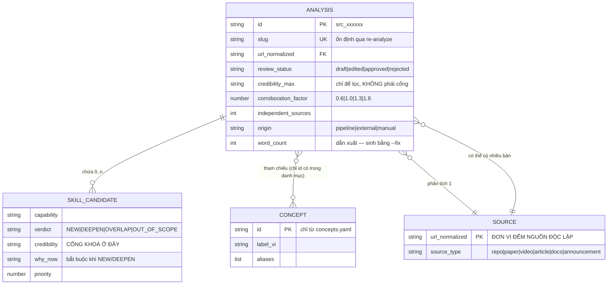
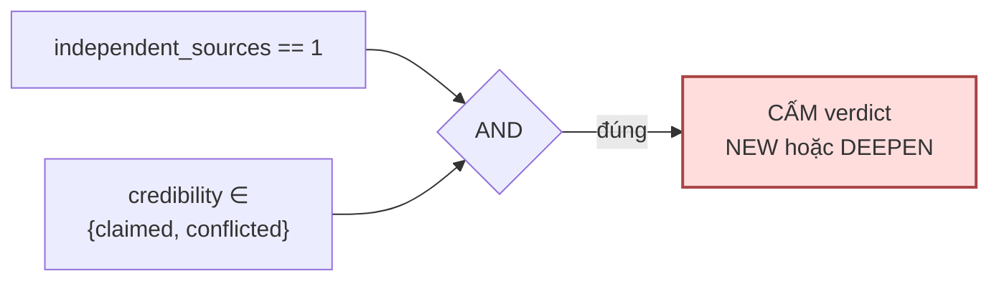

# Diagram — mô hình dữ liệu

> **Không có database.** ADR-04: nguồn chân lý là file `.md` trong git.
> "Bảng" dưới đây là *file và trường frontmatter*, không phải table SQL.
> Nơi ràng buộc **sống**: `core/assets/frontmatter.schema.json`.

## Thực thể



## Ba quan hệ dễ hiểu sai

**SOURCE ⟷ ANALYSIS là một-nhiều, không phải một-một.**
Ba người phân tích cùng một paper ⇒ ba file `.md`, nhưng vẫn là **một** nguồn.
Hệ số kiểm chứng đếm theo `url_normalized`, **không** theo số file. Đây là chỗ
độ tin bị thổi phồng dễ nhất (BRD B-A3).

Gộp xảy ra **lúc truy vấn**, không lúc lưu. Mỗi bản vẫn là một file độc lập;
frontmatter chỉ mô tả chính nó, không chứa danh sách các bản khác.

**Cổng khoá ở `SKILL_CANDIDATE.credibility`, không ở `ANALYSIS.credibility_max`.**
Một file có một khẳng định `verified` và bốn khẳng định `claimed` vẫn mang
`credibility_max: verified` — gác bằng trường đó sẽ **lọt**.

**CONCEPT là danh mục đóng.** `concepts[]` chỉ chứa `id` có trong
`kb/concepts.yaml`. Không khớp ⇒ `concepts_proposed[]`, và mục chờ duyệt **không
tính** vào hệ số (BRD B-C2).

## Ràng buộc cưỡng chế bằng máy



Cưỡng chế bằng JSON Schema conditional `allOf`, **không** bằng câu văn. LLM không
lách được. Test: `test_claimed_mot_nguon_khong_duoc_thanh_skill`.

→ BRD B-A2 · bằng chứng: Stanford 2025, 17–34% truy vấn bịa kể cả có RAG.

## Lưu trữ

```
kb/<source_type>/<slug>.md      bản hiện hành
kb/<source_type>/<slug>.v1.md   bản cũ khi re-analyze
kb/concepts.yaml                danh mục kiểm soát
```

`slug` **ổn định** qua mọi lần re-analyze — nhờ vậy `git diff` giữa hai bản đọc
được bằng mắt, và diff đó tự nó là một loại nội dung: *nguồn này đã đổi gì*.

## Chỉ mục dẫn xuất — chưa làm

ADR-04: chưa cần. Nếu vượt vài trăm file, thêm index sinh lúc build.
**Ràng buộc bất biến**: xoá sạch index rồi dựng lại từ `kb/` phải ra đúng trạng
thái cũ.
