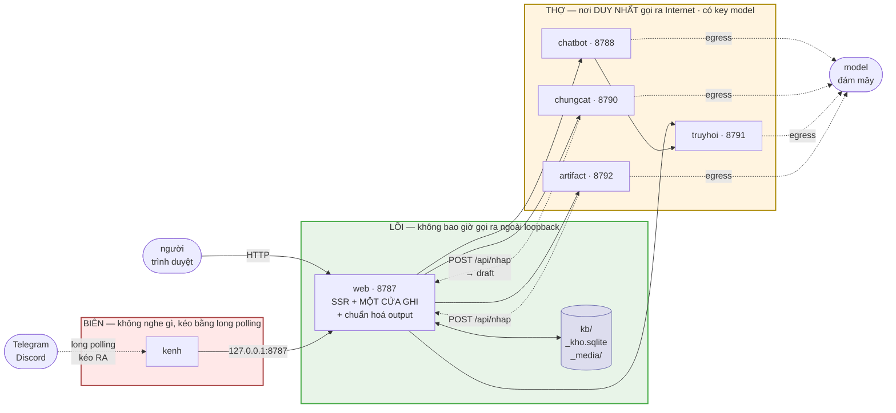
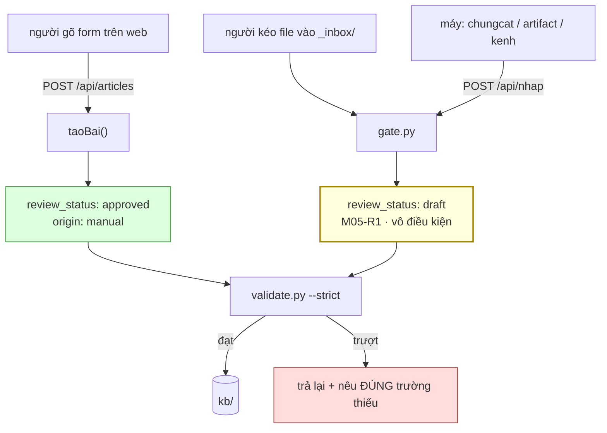
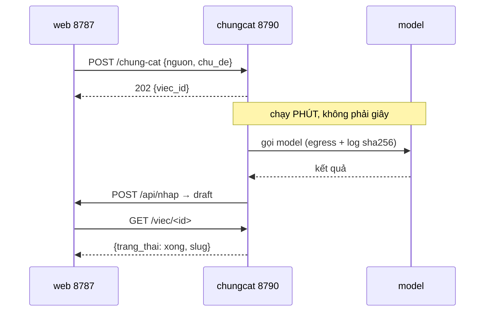

# Flow đợt hai — ba vùng, sáu tiến trình

> s4 · 2026-08-31. Nguồn: `03_docs/spec_overview.md` · `04_system/adr.md#ADR-05` ·
> `core/assets/dich-vu.json`. Số cổng đọc từ bảng khai, **đừng gõ lại ở đây**.

## 1 · Ai gọi ai

**Ba điều đọc được từ hình:**

1. **`web` là nút duy nhất chạm cả ba phía** — người, kho, và mọi service. Đó là
   cái giá của *"chuẩn hoá output quy về web"*: một chỗ để sửa, cũng là một chỗ
   để chết.
2. **Không mũi tên nào đi thẳng từ `kenh` tới `chatbot`.** Nếu có, sẽ có **hai**
   nơi dựng output từ cùng một service, và chúng sẽ lệch.
3. **Mọi mũi tên `egress` xuất phát từ THỢ.** LÕI và BIÊN không có mũi tên nào
   tới `model` — và điều đó cưỡng chế bằng **biến môi trường**, không bằng lời
   dặn: chúng khởi động không có key (`security_baseline §3.1`).

## 2 · Một bản ghi đi vào kho bằng đường nào

**Chỗ dễ hiểu sai nhất của cả hệ**, đo được ở `web/api/articles.mjs:465-472`:

> `POST /api/articles` đặt `review_status = "approved"` **vô điều kiện**. Nó là
> cửa cho **người tự viết** — người viết chính là người duyệt.

Nên **máy KHÔNG được dùng cửa đó**. `POST /api/nhap` là cửa thứ hai, chạy đúng
`gate.py` và ép `draft`. Cùng một cài đặt, hai lối vào — viết hai bản là hai bản
sẽ lệch.

## 3 · Việc dài — API bất đồng bộ

Ba câu **s4 chưa trả lời**, s6/s7 phải trả — xem `build_order.md`:
job chạy hai lần thì sao · thợ chết thì việc treo bao lâu · giới hạn thử lại.

Câu ba không thuần kỹ thuật: **mỗi lần thử lại là một lần tài liệu rời khỏi máy**
(`security_baseline §4b` bậc 4), và mỗi lần đều phải có log.

## 4 · Phủ module

| Module | Có trong hình |
|---|---|
| M01_core | trong `validate.py` (hình 2) |
| M02_kb | nút `kb/` |
| M03_web + M08_api | nút `web` |
| M05_intake | nút `gate.py` (hình 2) |
| M12_chungcat | `chungcat` |
| M13_truyhoi | `truyhoi` |
| M14_chatbot | `chatbot` |
| M15_kenh | `kenh` |
| M16_artifact | `artifact` |

M04_ci · M06_skillgen · M07_curate · M09–M11 không xuất hiện: chúng không phải
tiến trình chạy (CI, module ngang khai hợp đồng, công cụ chạy tay).
