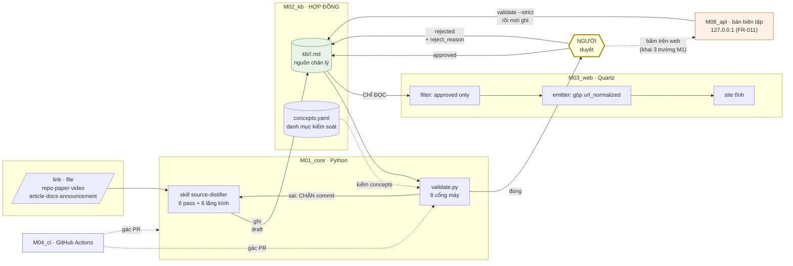
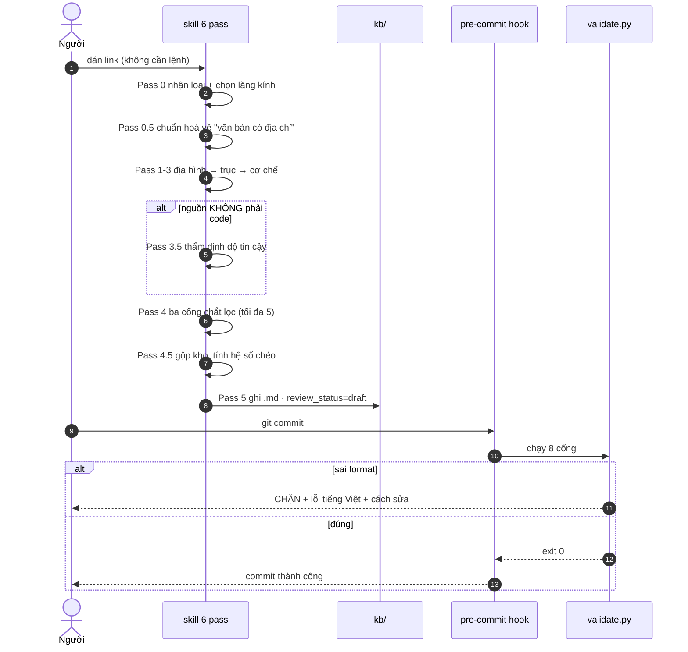
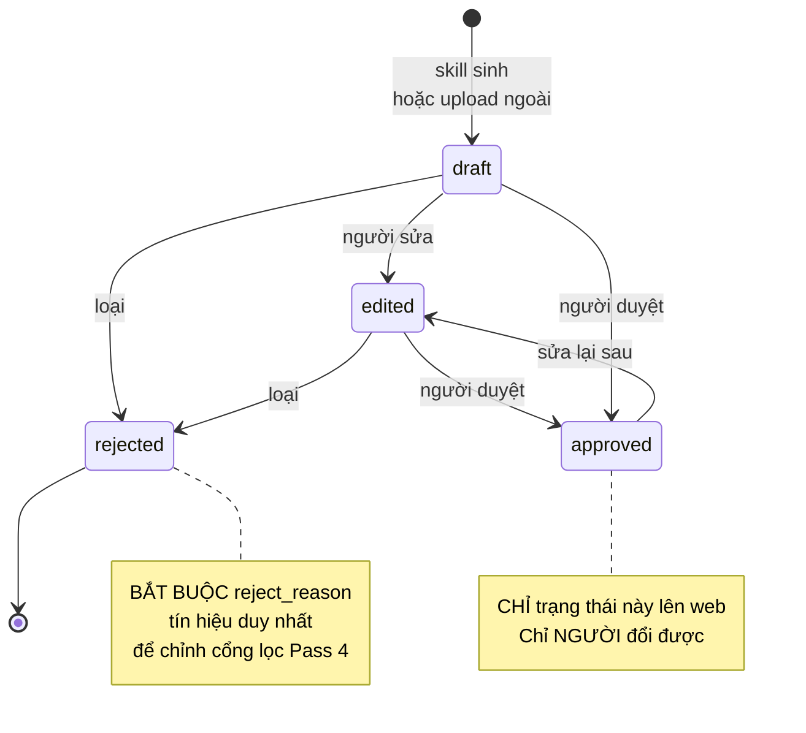
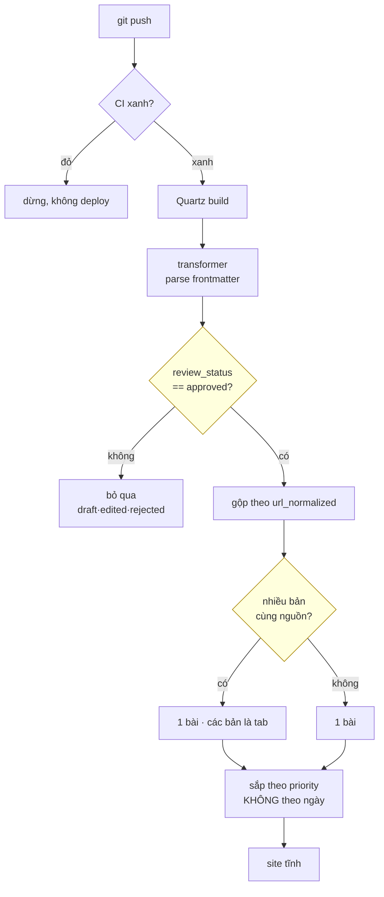

# Diagram — flow tổng hệ thống

> Socket `diagram` trống ⇒ chạy chay bằng mermaid, hợp lệ theo luật socket.
> Sinh từ `03_docs/spec_overview.md` + `project_map.yaml`. Map đổi ⇒ sửa hình.

## F0 · Toàn cảnh — bốn module, một chiều dữ liệu

**Đọc hình**: một cổng người (ô vàng), sáu bước máy. **Bundle tĩnh** của
`M03_web` chỉ có mũi tên **vào** từ `M02_kb` — không có mũi tên ra, đó là
BRD B-C3 (bản FR-011). Đường ghi từ trình duyệt đi qua `M08_api` — tiến trình
local riêng người tự chạy, và mọi mũi tên của nó vào `kb/` đều xuyên qua ô
validate: người bấm, máy kiểm, rồi mới ghi.

---

## F1 · Ingest — link tới draft

**Điểm chặn**: Pass 3.5 chỉ chạy cho nguồn phi-code — code tự làm bằng chứng cho
chính nó. Hook chặn **trước khi** file vào lịch sử git.

---

## F2 · Review — cổng người duy nhất

Máy không có mũi tên nào tới `approved`. Đó là BRD B-B1. FR-011 thêm một BỀ MẶT
cho mũi tên của người (nút duyệt ở cửa sổ đọc, qua M08) — chủ thể vẫn là người:
3 trường M1 do người khai, code M08 không có default (`api-status.test.js`).

---

## F3 · Publish — approved tới web

Hai ô vàng là hai chỗ phải viết plugin riêng — phần duy nhất Quartz không cho sẵn
(ADR-01).

---

## Phủ module — điều kiện đóng G4

| Module   | Xuất hiện ở |
| -------- | -------------- |
| M01_core | F0, F1         |
| M02_kb   | F0, F1, F2, F3 |
| M03_web  | F0, F3         |
| M04_ci   | F0, F3         |

Mọi module đều được phủ.
