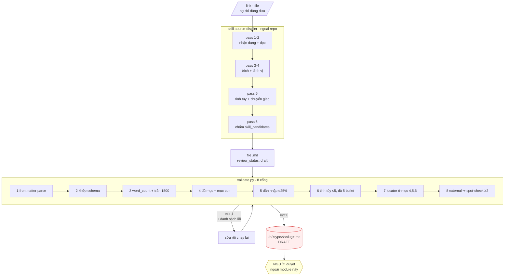

# M01_core — diagram flow

**Cổng chặn giữa các pass**: pass sau không chạy nếu pass trước chưa đạt. Hình
trên vẽ đường thành công; đường trượt quay lại pass đang đứng, không nhảy cóc.

Mũi tên cuối ra khỏi module: M01 **không** duyệt. Nó dừng ở `draft`.
