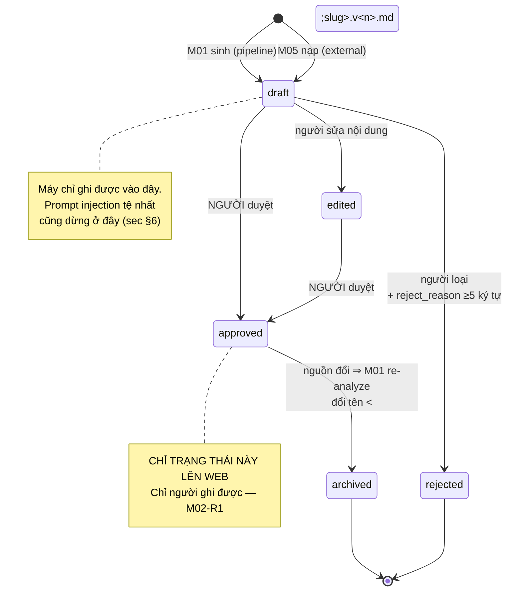
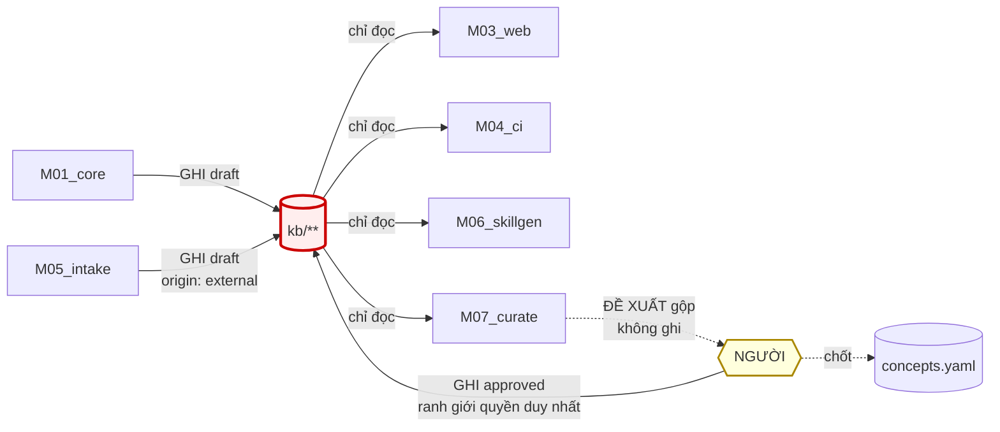

# M02_kb — diagram flow

> Chạy chay bằng mermaid (socket `diagram` trống). Vẽ từ, và khớp với, F0 của
> `04_system/diagrams/flow-tong.md`. Map đổi ⇒ sửa hình.

## Vòng đời một bản phân tích

## Ai chạm vào kho

Hai mũi tên GHI, bốn mũi tên chỉ đọc. M07 nét đứt vì nó **đề xuất**, người ghi.
