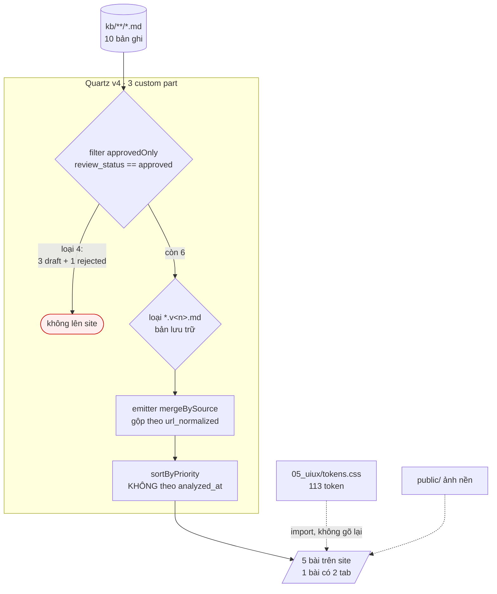
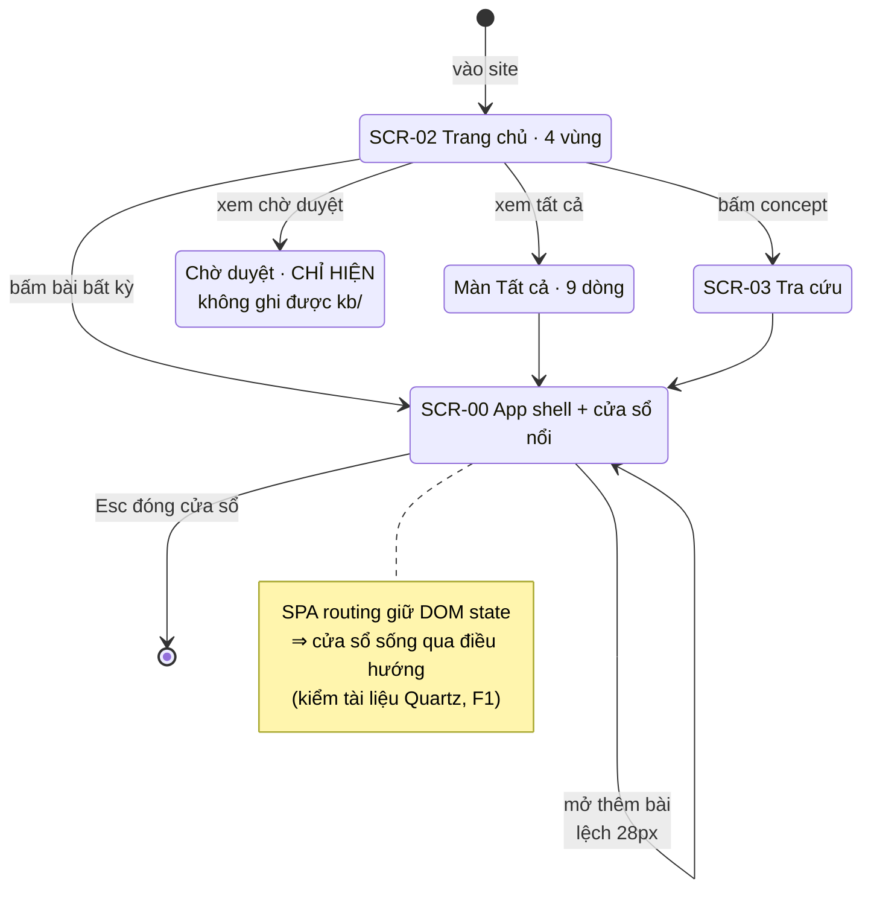

# M03_web — diagram flow

## Build pipeline

**Ba tầng số** — 10 bản ghi → 9 dòng màn *Tất cả* → 5 bài site. Không phải lệch
dữ liệu: mỗi tầng một phép lọc khác nhau.

**Thứ tự bắt buộc**: lọc `approved` **trước**, gộp **sau**. Ngược lại thì một bản
`draft` kéo bản `approved` cùng nguồn lên site.

## Điều hướng và cửa sổ đọc

