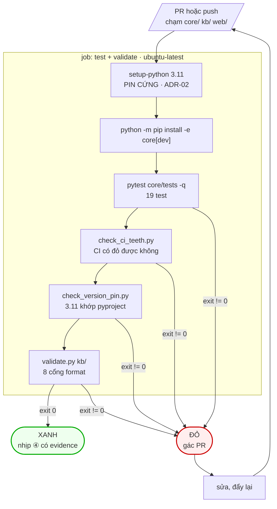
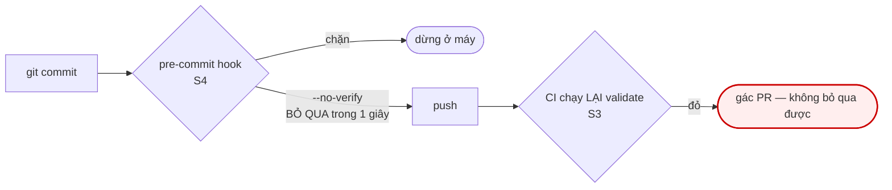

# M04_ci — diagram flow

## Vì sao S3 và S4 là hai bề mặt

Hook nhanh nhưng bỏ qua được. CI chậm nhưng ở chỗ agent không với tới. Chạy hai
lần không phải thừa — là hai bề mặt khác nhau của cùng một luật.
