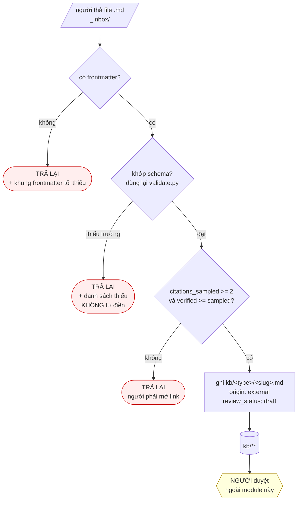
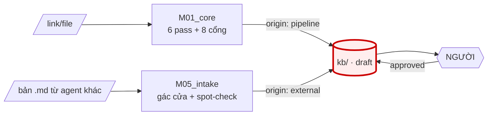

# M05_intake — diagram flow

Ba đường trả lại, một đường vào. Đường vào **luôn** kết thúc ở `draft` — không có
nhánh nào tới `approved`.

## Hai đường vào kho, cùng đích

Hai module, hai `origin` khác nhau, **cùng một trạng thái ra**: `draft`.
