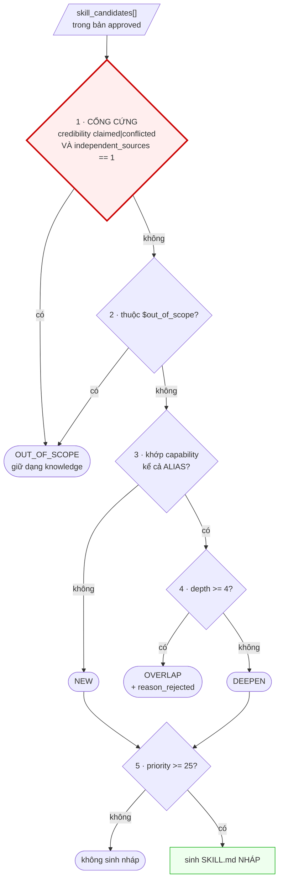
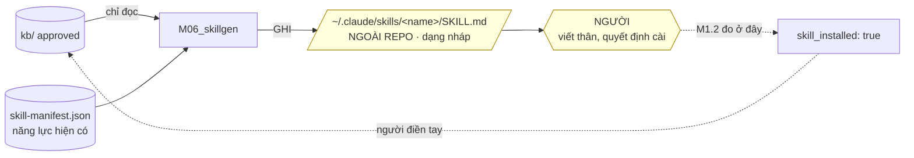

# M06_skillgen — diagram flow

## Năm cổng — thứ tự là luật

**Cổng 1 thắng mọi cổng dưới.** Chạy cổng 2 trước cổng 1 cho ra `NEW` cho ứng viên
schema đã cấm — lỗi tôi mắc ở lượt kiểm đầu.

## Nháp đi đâu

M06 **không** ghi vào `kb/`. Vòng khép lại bằng tay người: người điền
`skill_installed` sau khi cài và thấy output agent đổi.
