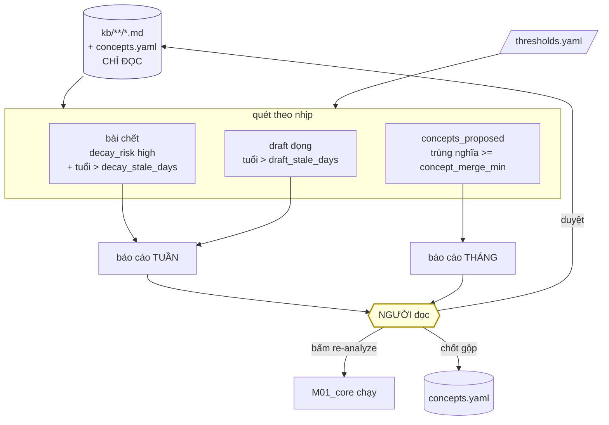
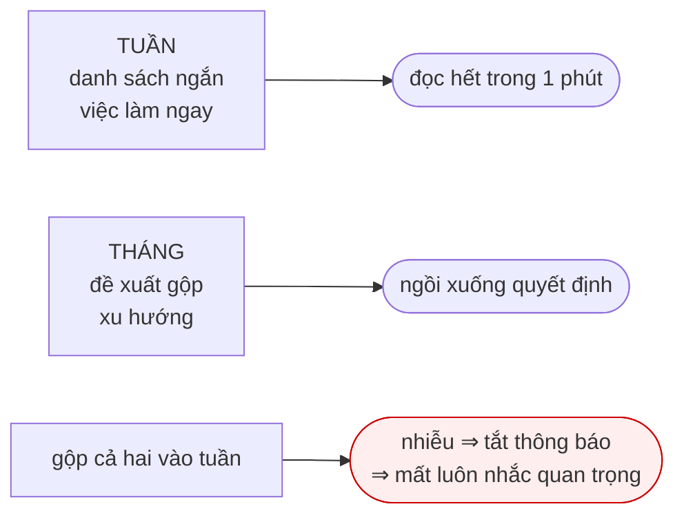

# M07_curate — diagram flow

```mermaid
flowchart TB
    KB[("kb/**/*.md<br/>+ concepts.yaml<br/>CHỈ ĐỌC")] --> SCAN
    TH[/"thresholds.yaml"/] --> SCAN

    subgraph SCAN["quét theo nhịp"]
        S1["bài chết<br/>decay_risk high<br/>+ tuổi > decay_stale_days"]
        S2["draft đọng<br/>tuổi > draft_stale_days"]
        S3["concepts_proposed<br/>trùng nghĩa >= concept_merge_min"]
    end

    S1 --> RW["báo cáo TUẦN"]
    S2 --> RW
    S3 --> RM["báo cáo THÁNG"]

    RW --> HUMAN{{"NGƯỜI đọc"}}
    RM --> HUMAN
    HUMAN -->|"bấm re-analyze"| M01["M01_core chạy"]
    HUMAN -->|"chốt gộp"| CON[("concepts.yaml")]
    HUMAN -->|"duyệt"| KB

    style KB fill:#eef,stroke:#448
    style HUMAN fill:#ffd,stroke:#a80,stroke-width:2px
```

**Mọi mũi tên ra khỏi M07 đều đi qua người.** Module không có đường nào chạm `kb/`.

## Vì sao tách hai nhịp

```mermaid
flowchart LR
    T1["TUẦN<br/>danh sách ngắn<br/>việc làm ngay"] --> OK1(["đọc hết trong 1 phút"])
    T2["THÁNG<br/>đề xuất gộp<br/>xu hướng"] --> OK2(["ngồi xuống quyết định"])
    BAD["gộp cả hai vào tuần"] --> NOISE(["nhiễu ⇒ tắt thông báo<br/>⇒ mất luôn nhắc quan trọng"])

    style NOISE fill:#fee,stroke:#c00
```
