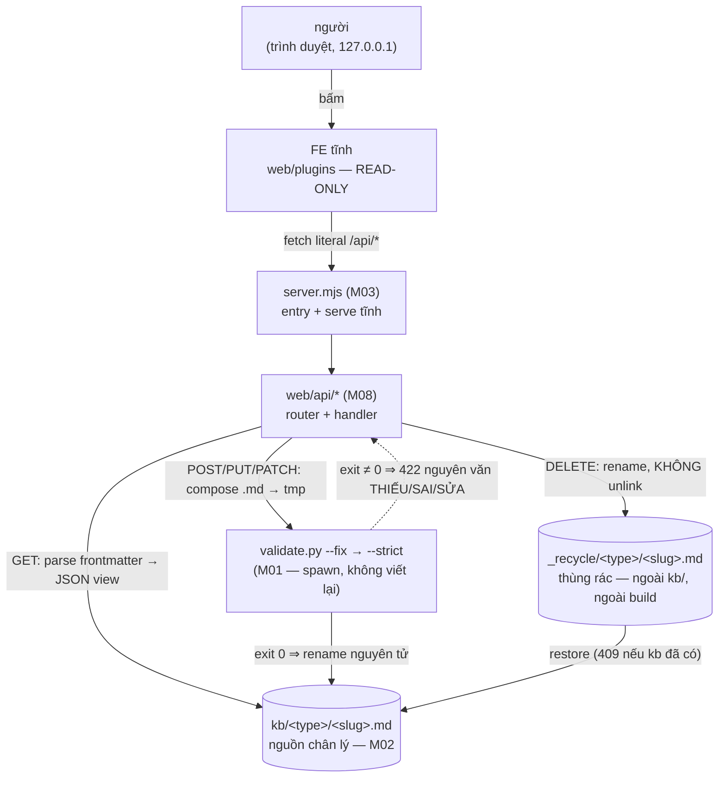

# M08_api — diagram flow

Vẽ từ, và khớp với, `04_system/diagrams/flow-tong.md` (F2 sau FR-011 có nhánh
"duyệt qua API"). Mọi mũi tên GHI đều đi qua nút validate — không có đường tắt.

Ba điều diagram này cam kết:

1. **FE không chạm đĩa** — mọi thứ đi qua HTTP tới server local; bundle tĩnh
   deploy không có API vẫn nguyên chức năng đọc.
2. **Không mũi tên nào từ API thẳng vào `kb/`** cho thao tác ghi — bắt buộc ghé
   `validate.py` trước (M08-R2).
3. **Không mũi tên nào ra thùng rác vĩnh viễn** — DELETE dừng ở `_recycle/` (M08-R4).
