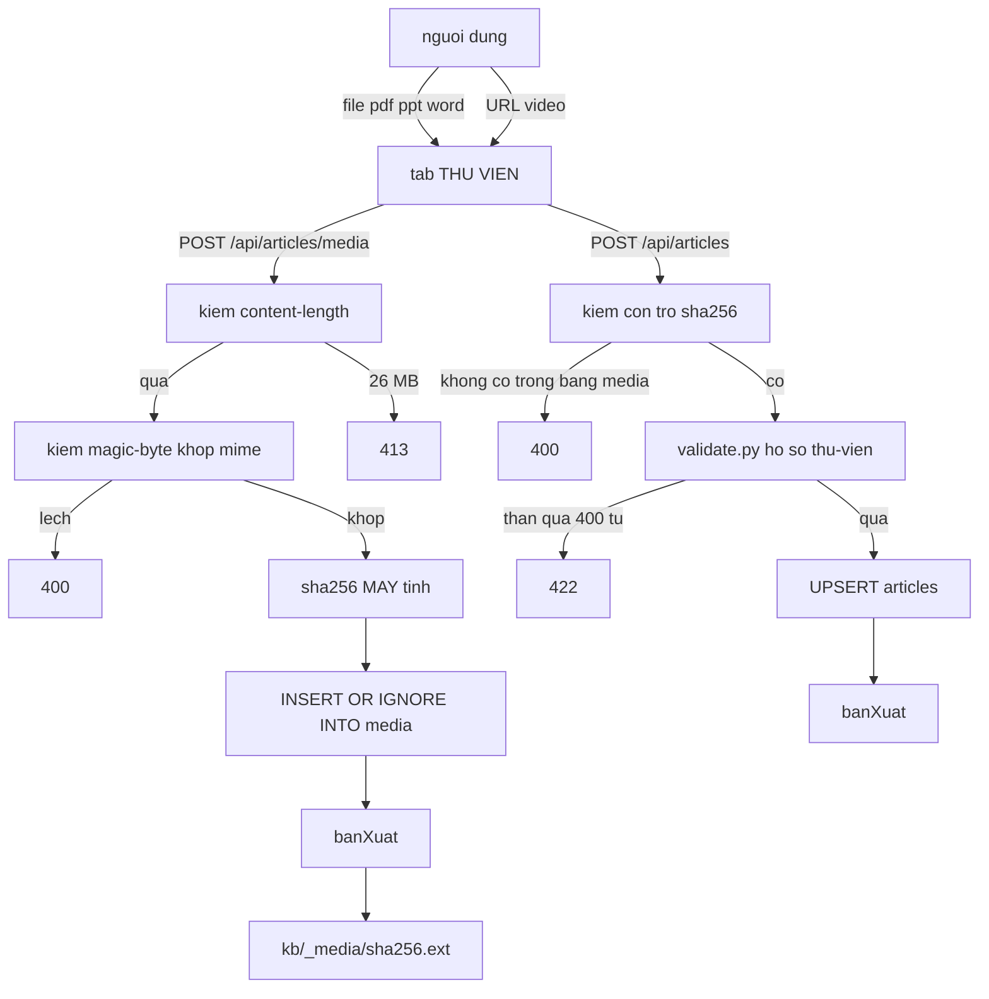
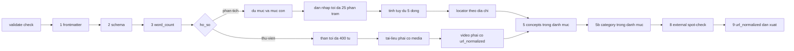
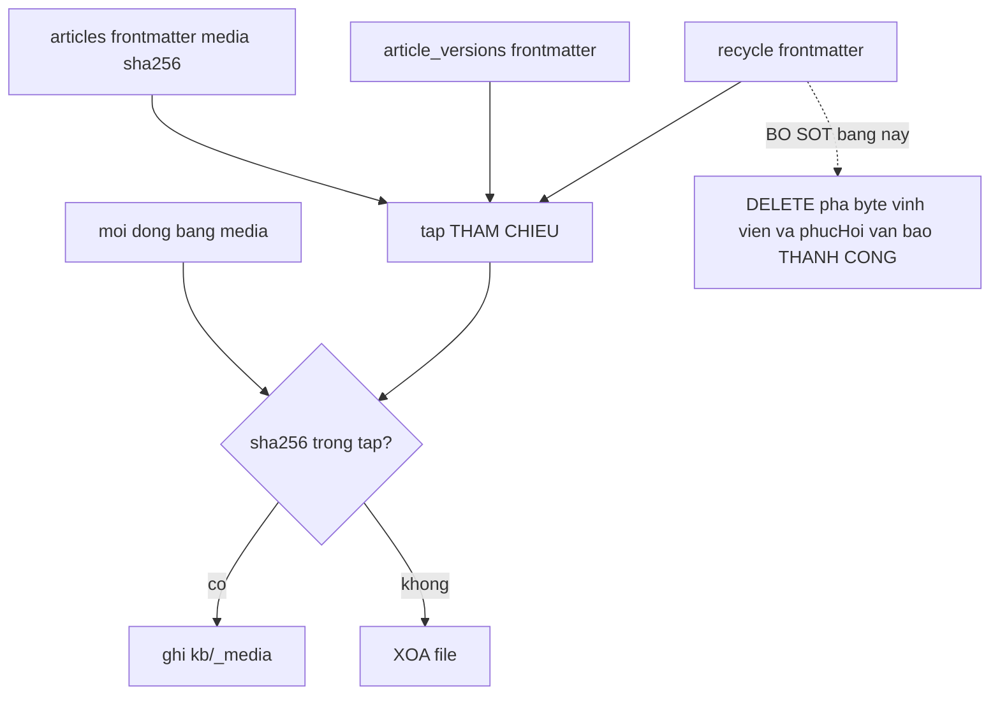
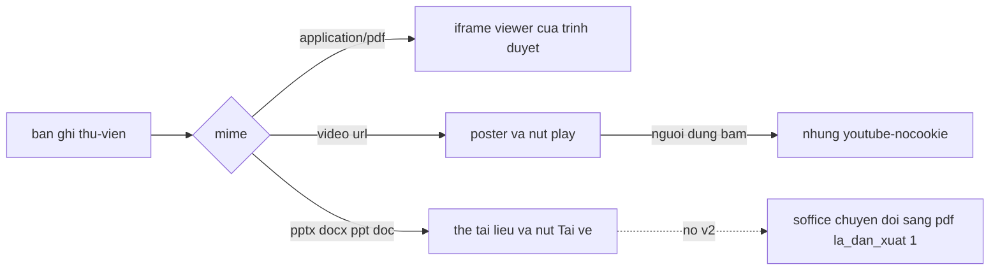

# M09_thuvien — diagram flow

## Hai đường nạp, một cửa ghi

```mermaid
flowchart TD
    U["nguoi dung"] -->|"file pdf ppt word"| F["tab THU VIEN"]
    U -->|"URL video"| F
    F -->|"POST /api/articles/media"| M1["kiem content-length"]
    M1 -->|"qua"| M2["kiem magic-byte khop mime"]
    M1 -->|"26 MB"| E1["413"]
    M2 -->|"lech"| E2["400"]
    M2 -->|"khop"| M3["sha256 MAY tinh"]
    M3 --> M4["INSERT OR IGNORE INTO media"]
    M4 --> M5["banXuat"]
    M5 --> B["kb/_media/sha256.ext"]
    F -->|"POST /api/articles"| G1["kiem con tro sha256"]
    G1 -->|"khong co trong bang media"| E3["400"]
    G1 -->|"co"| G2["validate.py ho so thu-vien"]
    G2 -->|"than qua 400 tu"| E4["422"]
    G2 -->|"qua"| G3["UPSERT articles"]
    G3 --> G4["banXuat"]
```

## Hồ sơ nào áp cổng nào

```mermaid
flowchart LR
    V["validate check"] --> C1["1 frontmatter"]
    C1 --> C2["2 schema"]
    C2 --> C3["3 word_count"]
    C3 --> H{"ho_so"}
    H -->|"phan-tich"| P1["du muc va muc con"]
    P1 --> P2["dan nhap toi da 25 phan tram"]
    P2 --> P3["tinh tuy du 5 dong"]
    P3 --> P4["locator theo dia chi"]
    H -->|"thu-vien"| T1["than toi da 400 tu"]
    T1 --> T2["tai-lieu phai co media"]
    T2 --> T3["video phai co url_normalized"]
    P4 --> C5["5 concepts trong danh muc"]
    T3 --> C5
    C5 --> C6["5b category trong danh muc"]
    C6 --> C8["8 external spot-check"]
    C8 --> C9["9 url_normalized dan xuat"]
```

## Luật mồ côi — union BA bảng

```mermaid
flowchart TD
    A["articles frontmatter media sha256"] --> S["tap THAM CHIEU"]
    B["article_versions frontmatter"] --> S
    R["recycle frontmatter"] --> S
    M["moi dong bang media"] --> X{"sha256 trong tap?"}
    S --> X
    X -->|"co"| K["ghi kb/_media"]
    X -->|"khong"| D["XOA file"]
    R -.->|"BO SOT bang nay"| L["DELETE pha byte vinh vien va phucHoi van bao THANH CONG"]
```

## Ba hình xem trước

```mermaid
flowchart LR
    B["ban ghi thu-vien"] --> Q{"mime"}
    Q -->|"application/pdf"| P["iframe viewer cua trinh duyet"]
    Q -->|"video url"| V["poster va nut play"]
    V -->|"nguoi dung bam"| V2["nhung youtube-nocookie"]
    Q -->|"pptx docx ppt doc"| T["the tai lieu va nut Tai ve"]
    T -.->|"no v2"| S["soffice chuyen doi sang pdf la_dan_xuat 1"]
```
