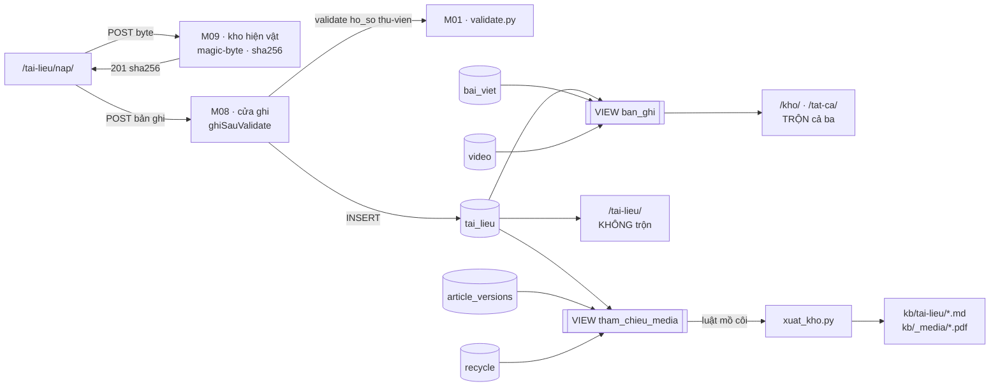
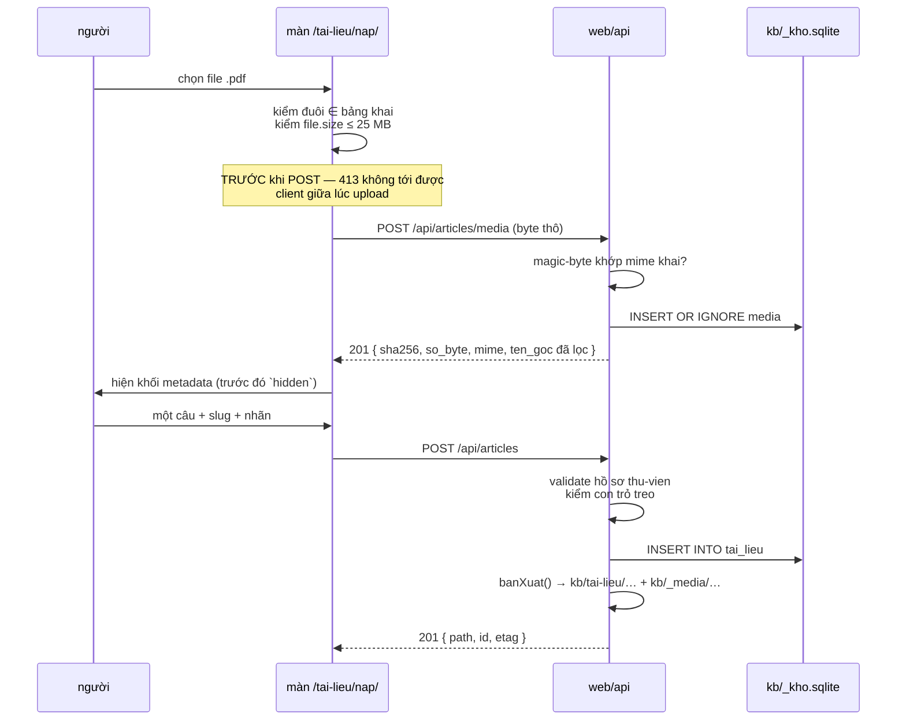
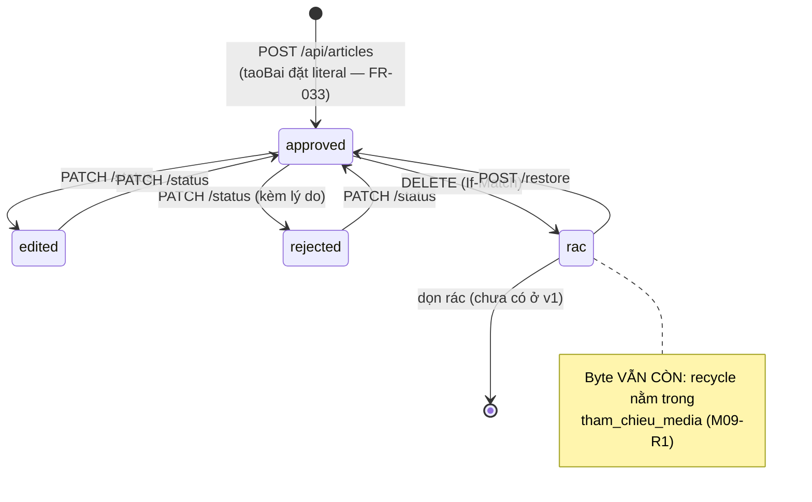

# M10_tailieu — diagram flow

## Vị trí trong hệ

Hai điều hình này nói ra mà văn xuôi hay bỏ qua:

**`tai_lieu` chảy vào HAI view, hai mục đích.** `ban_ghi` cho đường **đọc** (Kho,
Tổng hợp, `khoDoc()`); `tham_chieu_media` cho **luật mồ côi**. Bỏ nhánh `tai_lieu`
khỏi view thứ hai là mỗi DELETE phá byte vĩnh viễn (M09-R1).

**Màn `/tai-lieu/` đọc bảng, không đọc view.** Đó là điều tách ra: nếu nó đọc
`ban_ghi` rồi lọc trong JS thì nó vẫn là màn gộp, chỉ khác chỗ lọc.

## Đường nạp — hai request, một lần bấm

## Vòng đời một bản ghi

## Chỗ dễ vỡ, đánh dấu trên hình

| # | Chỗ | Vỡ ra sao |
|---|---|---|
1 | `tai_lieu` → `ban_ghi` | thiếu nhánh ⇒ `xuat_kho.py:141-146` coi mọi `.md` loại này là mồ côi và **xoá sạch**; `banXuat()` chạy tự động nên không cần ai gõ lệnh |
2 | `tai_lieu` → `tham_chieu_media` | thiếu nhánh ⇒ mỗi DELETE phá byte, và `phucHoi()` vẫn báo thành công |
3 | màn đọc `ban_ghi` thay vì bảng | màn "tách" thành màn gộp có lọc — M10-R1 đo bằng số đếm |
4 | form sửa thiếu ô `media` | mất con trỏ im lặng, lỗi lộ ở lần dựng lại DB kế tiếp — M10-R2 |
