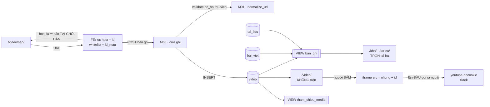
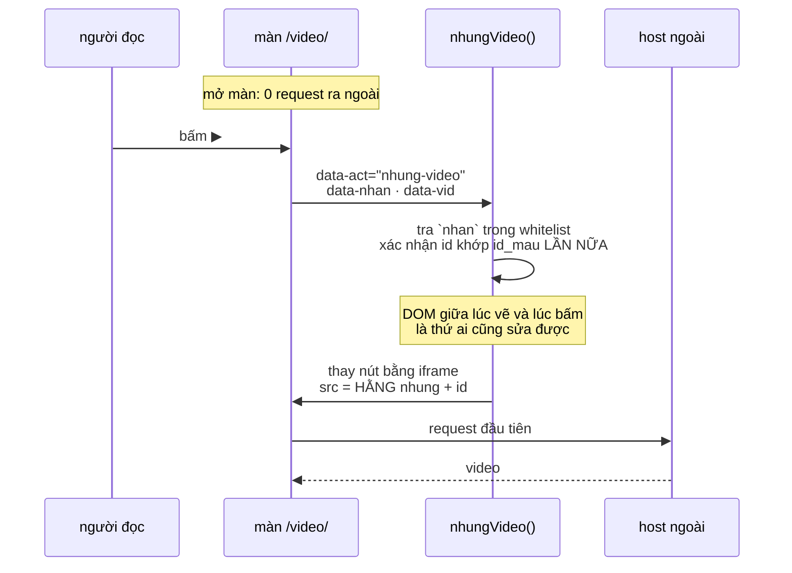
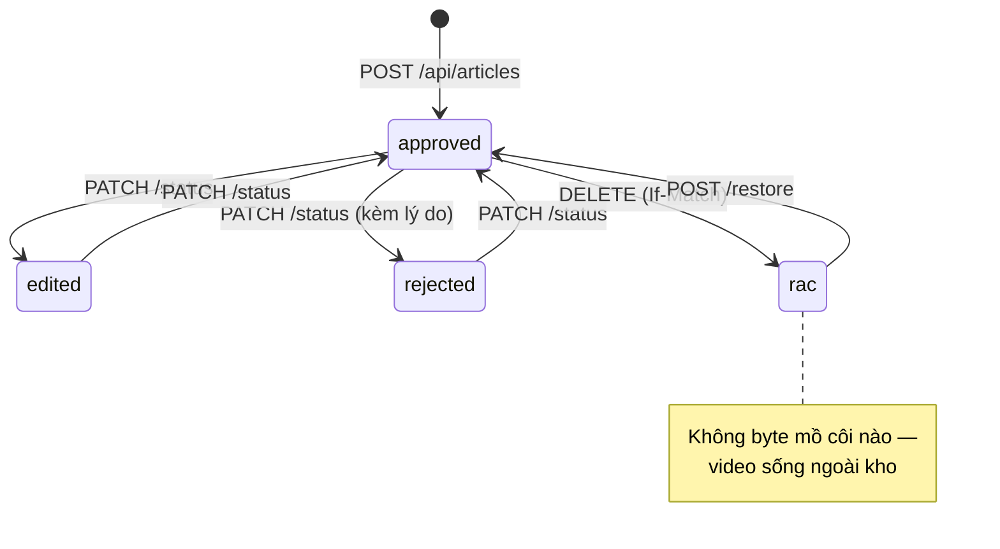

# M11_video — diagram flow

## Vị trí trong hệ

Ba điều hình này nói ra:

**Đường nạp là MỘT request**, không hai. `tai_lieu` phải POST byte trước rồi POST
bản ghi; `video` chỉ POST bản ghi. Đó là khác biệt cấu trúc, không phải chi tiết.

**`video` VẪN chảy vào `tham_chieu_media`** dù video không có byte. Vì schema là
`anyOf [media | url]` — nó **không cấm** một bản ghi video khai cả `media`. Bỏ
nhánh này vì "video không có byte" là đúng lớp lỗi M09-R1.

**Mũi tên gạch nối là mũi tên duy nhất ra khỏi máy người dùng** trong cả sản phẩm,
và nó chỉ tồn tại **sau một cú bấm**.

## Đường nhúng — click-to-load

## Vòng đời

## Chỗ dễ vỡ

| # | Chỗ | Vỡ ra sao |
|---|---|---|
1 | `video` → `ban_ghi` | thiếu nhánh ⇒ `xuat_kho.py:141-146` coi mọi `.md` loại `video` là mồ côi và **xoá sạch**; `banXuat()` chạy tự động sau mỗi lần ghi |
2 | `video` → `tham_chieu_media` | dễ bỏ sót vì "video không có byte" — nhưng schema cho phép nó khai `media` |
3 | hàm dựng thẻ chứa `.nhung` | mở màn = 50 request ra ngoài; kiểm hai chiều ở B8b đã chứng minh phép kiểm "không chứa hằng host" xanh oan khi host qua một biến |
4 | `url_normalized` nhận từ client | hai video khác nhau gộp thành một, hoặc một video thành hai — hệ số kiểm chứng chéo bị thổi |
5 | báo lỗi host sau khi POST | người dùng đọc `422` thành "mạng lỗi" — cùng bài học `413` ở B5 |
