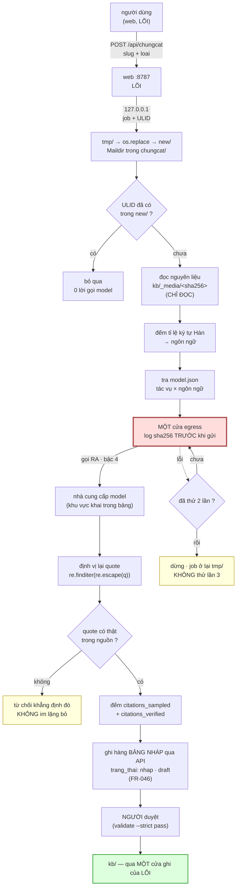
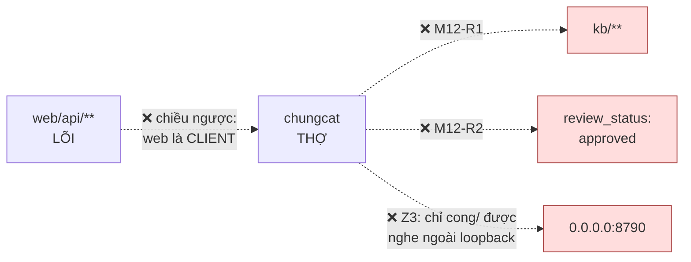

# M12_chungcat — diagram flow

> Vẽ từ, và phải khớp với, diagram tổng `04_system/` (ba vùng LÕI/THỢ/BIÊN).
> Mũi tên **ra Internet** chỉ được xuất phát từ khối THỢ — đó là `Z2` của ADR-05.

## Đường chính — một job đi hết vòng

## Ba chỗ đọc kỹ

**`E` (đỏ) — cửa egress duy nhất.** Mọi mũi tên ra Internet của cả hệ thống đi qua
đúng khối này. Log ghi **trước** khi gửi, nên một lần gửi bị timeout vẫn có dòng
log — đúng lúc cần biết nhất (`M12-R3`).

**`KB` (xanh) — M12 không có mũi tên nào trỏ thẳng vào đây.** Đường duy nhất là
bảng nháp (`FR-046`) → **người** duyệt → cửa ghi của LÕI. Vẽ một mũi tên trực
tiếp từ M12 vào `kb/` là vẽ vi phạm `M12-R1`.

⚠️ **Đổi 2026-09-02**: sơ đồ bản đầu vẽ `gate.py` trên đường của M12. Sau
`FR-046` thì **không** — `_inbox/`+`gate.py` là đường của bản **NGOÀI**. Rào thứ
hai của M12 nay là **mặc định `trang_thai: nhap`** của bảng nháp, không phải
`gate.py`. Vẽ sai chỗ này là vẽ một rào không tồn tại.

**`RT` — vòng thử lại có TRẦN, và trần đó là trần số lần dữ liệu rời máy**, không
phải trần chịu lỗi. Nhánh `STOP` để job lại `tmp/`: người chạy lại được, nhưng máy
thì không tự chạy lại.

## Chiều CẤM — vẽ ra để cổng biết đỏ vì gì

Mũi tên thứ ba dễ đọc sai: `web` **được** gọi `chungcat` (nó là client duy nhất).
Chiều bị cấm là `chungcat` **phục vụ** một request do `web/api/**` khởi tạo theo
kiểu callback vào lại lõi — tức thợ điều khiển lõi thay vì lõi điều phối thợ.
