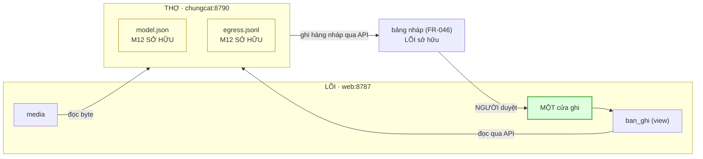
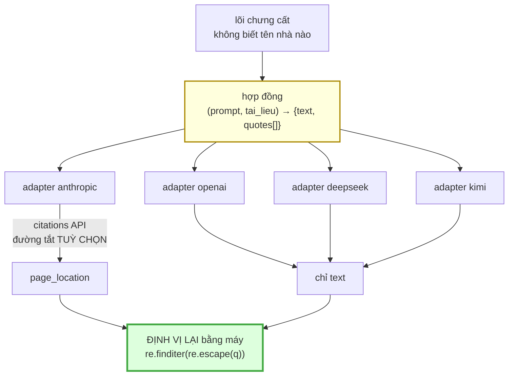

# M12_chungcat — model flow

> Entity vào/ra, và **gọi module nào qua contract nào**.
> "Model" ở đây có hai nghĩa và file này dùng **cả hai**, tách rõ:
> §1–§2 là *model dữ liệu* (entity); §3–§4 là *model ngôn ngữ* (LLM).

## 1 · Entity — M12 không sở hữu gì trong `kb/`



M12 sở hữu **đúng hai** artifact, cả hai nằm trong `chungcat/`. Mọi entity trong
`kb/` thuộc module khác ⇒ cần trường mới trên chúng thì **mở FR tới owner**, không
tự thêm (luật riêng s6).

## 2 · Contract với từng module

| gọi ai | qua contract nào | chiều |
|---|---|---|
| **M08_api** | `GET /api/articles/<slug>` · `GET /api/media/<sha>` trên `127.0.0.1:8787` | M12 → LÕI, **chỉ đọc** |
| **M08_api** | ghi hàng bảng nháp **qua API** (`FR-046`) | M12 → LÕI, một chiều |
| ~~M05_intake~~ | ~~file `.md` thả vào `_inbox/`~~ — **hết** từ `FR-046`; `_inbox/` vẫn là đường của bản **NGOÀI**, M12 không còn đi qua đó | — |
| **M01_core** | đọc `khung-than-bai.json` + `dia-chi.json` như **file**, không import mã | M12 → M01, chỉ đọc |
| **M13_truyhoi** | **không gọi** — M13 đọc kho sau khi bài đã duyệt | — |

⚠️ **M12 đọc `dia-chi.json` như FILE, không import `tach_dia_chi()` của Python.**
`M01-R4` cấm `core/` đọc `web/`; đối xứng, THỢ import mã của LÕI là dính hai vùng
lại và mọi thay đổi lõi phải chờ thợ. Cái giá: phép tách địa chỉ có **hai bản**
(Python trong `core/`, và bản của M12). Đó là cùng lớp lỗi đang làm
`check_danh_muc` đỏ, nên **phải có cổng đối chiếu hai bản** — khai thành nợ ở §5.

## 3 · Model ngôn ngữ — bảng khai, hai chiều tra

```
model.json:
  tac_vu           chung-cat | tong-hop
    × ngon_ngu     vi | en | zh
      → nha_cung_cap · model · khu_vuc · du_phong
        · ho_tro_citations · can_key
```

`ngon_ngu` **do máy đếm** (tỉ lệ ký tự Hán), không do model tự khai — model tự
khai ngôn ngữ rồi tự được chọn theo lời khai đó là nó cầm bút ghi vào thứ nó bị
chấm (luật gốc).

## 4 · Vì sao hợp đồng adapter phải MỎNG



Mũi tên quan trọng nhất là **cả hai nhánh đều vào `V`**. Kể cả khi provider trả
`page_location` được API bảo đảm, ta **vẫn** định vị lại. Không phải vì không tin
Anthropic — mà vì nếu đường Claude bỏ qua `V` thì `V` chỉ được chạy trên các nhà
khác, và một lỗi trong `V` sẽ không bao giờ lộ ra ở đường phổ biến nhất.

## 5 · Nợ hợp đồng, khai trước khi ai vấp

| nợ | vì sao chưa giải ở đây |
|---|---|
| **`nguon` chưa có trong schema** | `FR-044` duyệt nhưng chưa áp; file frozen + deny. Nửa `tong-hop` chưa có hợp đồng dữ liệu |
| **hai bản phép tách địa chỉ** | M12 không được import mã M01 (§2). Cần một cổng đối chiếu hai bản, cùng khuôn `check_danh_muc` — và `check_danh_muc` đang đỏ đúng vì lớp lỗi đó |
| **`chuan_hoa()` dùng chung với M13** | dải ký tự Hán phải là MỘT bảng khai, không hai regex. M13 định nghĩa; M12 đọc |
| **`model_da_dung` chưa có trong schema** | trường dẫn xuất mới; cần FR tới M01 (owner của schema) trước khi M12 ghi nó |
