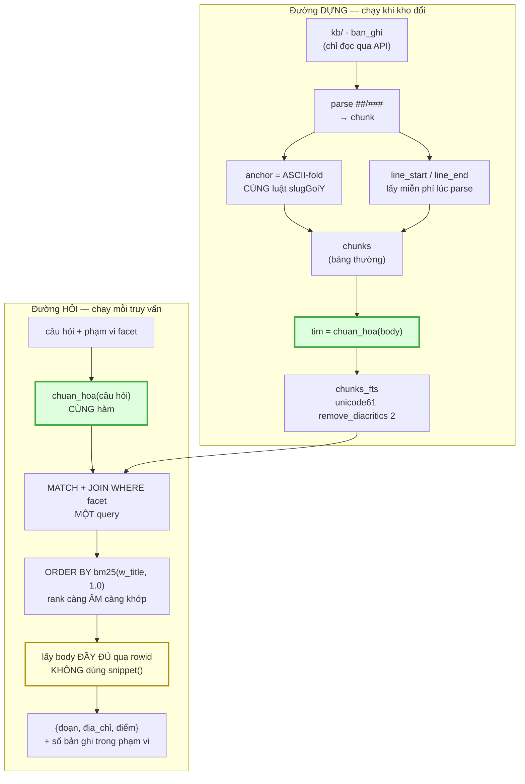
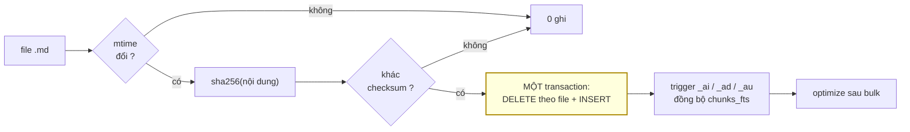
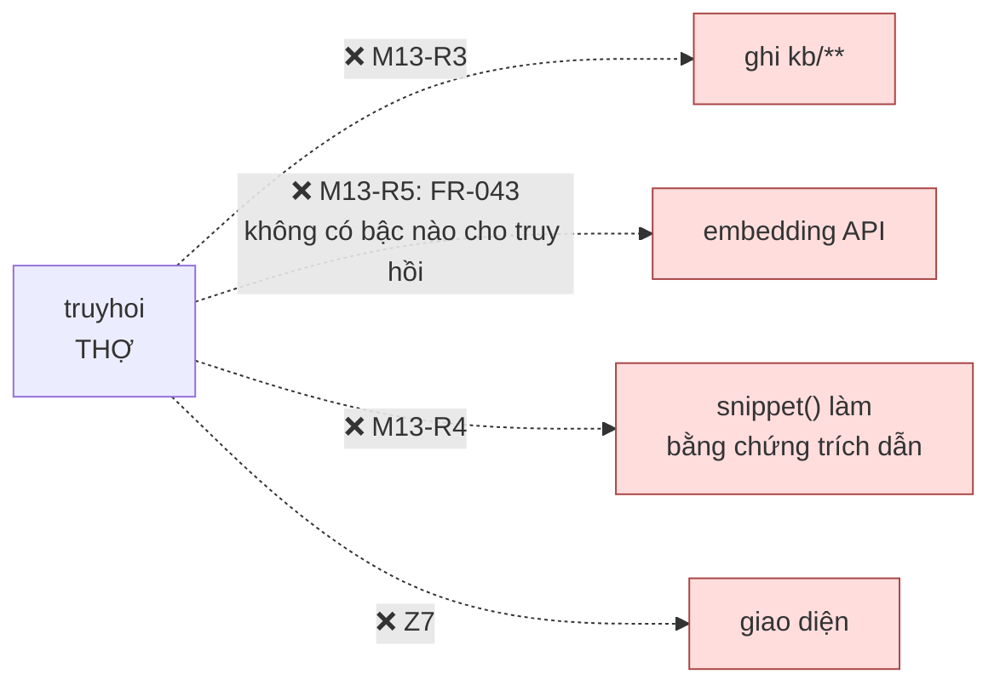
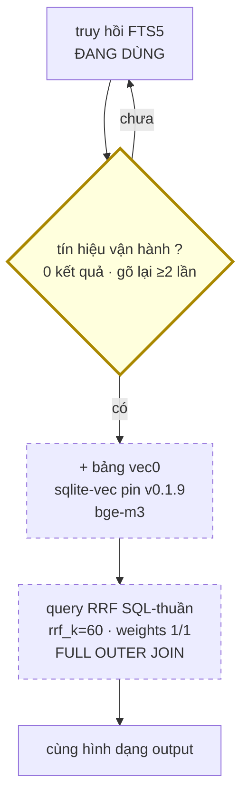

# M13_truyhoi — diagram flow

> Khớp diagram tổng `04_system/` (ba vùng). M13 ở **THỢ**, nhưng khác M12 ở một
> điểm quan trọng: nó **không có mũi tên nào ra Internet** (`M13-R5`).

## 1 · Hai đường, chạy độc lập

**Hai khối xanh là CÙNG MỘT HÀM** — đó là toàn bộ `M13-R1`. Vẽ chúng hai chỗ vì
chúng chạy ở hai thời điểm; nhưng nếu chúng thành hai *hàm*, hệ không báo lỗi, nó
chỉ trả ít kết quả hơn và không ai biết đã mất gì.

**Khối vàng** — `snippet()` trần 64 token nên chỉ làm preview; bằng chứng trích dẫn
lấy `body` đầy đủ (`M13-R4`).

## 2 · Re-index tăng dần — ba trigger và một cái bẫy

**Cái bẫy, chép nguyên mẫu `sqlite.org/fts5.html#external_content_tables`**: xoá
khỏi FTS external-content phải dùng `INSERT ... VALUES('delete', old.rowid, old.…)`
— FTS5 cần **GIÁ TRỊ CŨ**, không phải rowid. Viết `DELETE FROM chunks_fts` thẳng
thì bảng thường và FTS **lệch nhau IM LẶNG**: không báo lỗi, chỉ trả kết quả sai.

## 3 · Chiều CẤM

Mũi tên thứ hai đáng đọc kỹ: M13 **được** phép egress vì nó ở THỢ. Điều bị cấm
không phải "gọi ra ngoài" mà là **gọi ra ngoài theo một đường `FR-043` chưa khai
bậc nào** — tức không được log, không ai đếm. Muốn dùng thì mở FR, không phải thêm
một `import`.

## 4 · Điểm rẽ hybrid — vẽ trước, chưa dựng

Nét đứt = **chưa dựng**. Điều kiện tiên quyết **đã đạt** (đo 2026-09-01: SQLite
3.50.4, `FULL OUTER JOIN` chạy thật), nên khi rẽ thì chỉ thêm một bảng + một query,
**không đổi kiến trúc**. Điểm rẽ đo bằng tín hiệu vận hành, **không** bằng số bài
— và hai tín hiệu đó phải được **đếm và ghi** (`AC-7.1`), vì không có số thì không
ai biết đã tới lúc rẽ.
