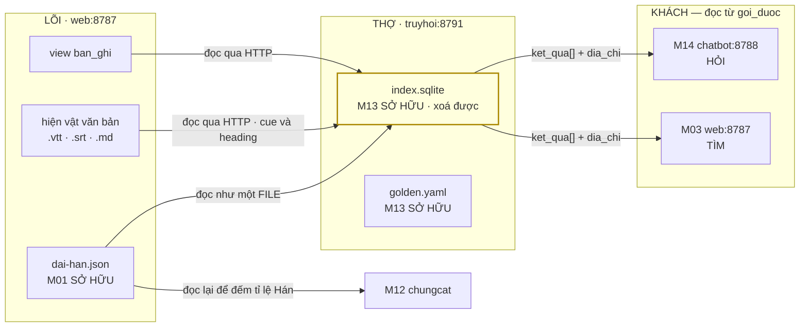
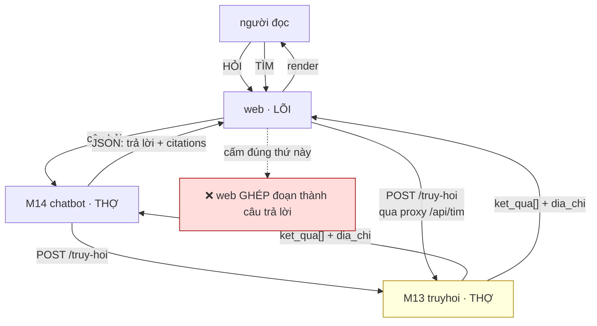

# M13_truyhoi — model flow

> Entity vào/ra, và **gọi module nào qua contract nào**.
> M13 **không gọi model ngôn ngữ nào** — nên file này chỉ nói về *model dữ liệu*.
> Đó là điểm khác lớn nhất với M12.

## 1 · Entity — M13 sở hữu một tầng có thể xoá

⚠️ **`FR-072` §1.2 · bảng khai dải Hán KHÔNG còn thuộc M13.** Bản trước vẽ nó trong
vùng của M13 (*"M13 SỞ HỮU"*) và viết *"mũi tên `HA → M12` là chỗ duy nhất M13 cung
cấp gì cho ai ngoài M14"*. Chốt PM 2026-09-09 (`research` §8 G6): file về
`core/assets/dai-han.json`, **chủ là M01** (`T01-51` · `FR-077`) — hai THỢ đọc một
file ở LÕI, **không THỢ nào sở hữu luật của THỢ kia**. Cả M13 và M12 đọc nó **như một
file**, không phải một lời gọi API. Hai module đọc một bảng thì không dính vào nhau;
hai module gọi nhau thì có.

Và M13 nay có **hai khách** ngay lượt đầu (M14 hỏi · web tìm), nên *"khách hàng duy
nhất"* đã hết đúng — xem §2.

## 2 · Contract với từng module

| với ai | qua contract nào | chiều |
|---|---|---|
| **M08_api** | `GET /api/kho-delta` (slug · loai · updated_at · sha_than · space — `T08-35`) · `GET /api/index` · `GET /api/articles/<slug>` · `GET /api/articles/media/<sha>` · `GET /api/xuat/<slug>/txt\|srt` — tất cả trên `127.0.0.1:8787` | M13 → LÕI, **chỉ đọc** |
| **M14_chatbot** | `POST /truy-hoi {cau_hoi, pham_vi, nguon, k}` → `{ket_qua[], so_ban_ghi_trong_pham_vi, tong}` — hình dạng `FR-072 §1.1`, xem `spec §1a` | M14 → M13 |
| **M03_web** | **CÙNG endpoint đó**, cho việc **TÌM** (trả đoạn + `dia_chi`, không ghép câu trả lời). Web gọi qua proxy `GET /api/tim` của LÕI (`T08-35`) — khoá ở lại server | M03 → M13 |
| **M12_chungcat** | chỉ chia sẻ **bảng khai dải Hán** như một file (chủ: M01) | không có lời gọi |
| **M01_core** | đọc `dia-chi.json` và `dai-han.json` như **file**, không import mã Python | M13 → M01, chỉ đọc |

**MỘT hợp đồng, mọi client** *(`FR-072` §1.1)*. Bản trước của bảng này khai
`{cau_hoi, pham_vi, k} → {doan[], so_ban_ghi_trong_pham_vi}` và viết *"M03 không gọi
trực tiếp"*; cả hai đã sai. Hình dạng đầy đủ ở `spec §1a`, giá trị mẫu ở
`05_uiux/contracts/truyhoi.sample.v3.json`. Ai được gọi vào đọc từ `goi_duoc` của
`truyhoi` trong `core/assets/dich-vu.json` (`AC-1.6` · `M13-R6` · `ADR-08` Z9), hôm
nay là `["web", "chatbot"]`.

⚠️ **Hai chữ `nguon`, hai trục** — `pham_vi.nguon` là facet **loại nguồn**; `nguon` ở
gốc payload là **tập nguồn Knowledge** (danh sách slug), do M14 giải từ `bot` rồi
truyền xuống. `FR-072 §1.1` duyệt cả hai tên; ô `backlog.md` mở để theo dõi.

⚠️ **`k` là tham số người gọi đưa, không phải hằng trong mã** (`AC-5.2`). Một `k`
gõ cứng biến "phạm vi là control hiển thị" thành "top-k ẩn" — đúng thứ `B-C2` cấm,
và nó cấm vì người dùng phải **thấy** mình đang hỏi trên tập nào.

## 3 · Hai đường, và hàng rào đặt ở ĐÚNG chỗ nó sợ

⚠️ **`FR-072` §1.4 · hàng rào đổi chỗ, không bị bỏ.** Bản trước của mục này vẽ mũi
tên đứt `web → M13` với lý do *"nếu web gọi thẳng M13 thì logic hỏi-đáp mọc vào web"*.
Lý do ấy **đúng cho hỏi-đáp** (ghép đoạn thành câu trả lời là việc của M14) và
**không áp cho TÌM** (trả danh sách đoạn + địa chỉ, không ghép gì). Đo 2026-09-07:
`PRD U6` hứa *"full-text trên tít, one_liner, thân bài"* từ đợt **một**, mà hôm nay ô
`#q` vẫn là `boDau(the.textContent).includes(tim)` — lọc chuỗi trên DOM **đã render**,
không phải retrieval. Nên *"web gọi M13 để tìm"* là **trả một nợ PRD**, không phải mở
phạm vi; và `ADR-08` đã bỏ luật *"web là client duy nhất"*.

Cái bẫy `build_order` C9 lường trước **vẫn còn nguyên**, chỉ được phát biểu đúng: cấm
`web` **ghép đoạn thành câu trả lời**, không cấm mũi tên. `M8.2 ≤ 20%` là phép đo cho
đúng chuyện đó — kênh thứ hai tốn hơn 20% công kênh thứ nhất nghĩa là chatbot đã mọc
nhầm chỗ.

## 4 · Hai hợp đồng phải khớp NGUYÊN VĂN

| hợp đồng | với ai | vì sao không được lệch |
|---|---|---|
| luật sinh **anchor** | M03_web (renderer) | chatbot trích `file#anchor`; lệch ⇒ trỏ vào anchor trang không có ⇒ link chết **im lặng** |
| **dải ký tự Hán** | M12_chungcat | M13 dùng để chèn cách khi index; M12 dùng để đếm tỉ lệ định tuyến model. Hai regex khác nhau ⇒ một tài liệu được index kiểu này, định tuyến kiểu khác |

Cả hai đều là **một luật, hai chỗ dùng**. Cách duy nhất giữ chúng khớp là **một
nguồn** (bảng khai / cùng một hàm) cộng **một cổng đối chiếu**. Kỷ luật không đủ:
dự án này đang có `check_danh_muc` đỏ đúng vì hai bản của một schema.

## 5 · Nợ hợp đồng

| nợ | vì sao chưa giải ở đây |
|---|---|
| **`chuan_hoa_tim()` chưa có bản Python** | luật ASCII-fold chỉ có bản JS. Bản Python của M13 là bản thứ hai ⇒ `M13-R2` là cổng bắt buộc, không tuỳ chọn. Tên hàm chốt là `chuan_hoa_tim` *(PM 2026-09-09)* vì `chungcat/src/verify.py:55` đã có `chuan_hoa` khác nghĩa |
| **dải ký tự Hán chưa là bảng khai** | hiện là một regex gõ cứng ở `chungcat/src/dinh_tuyen.py:25`. Chủ mới là **M01** — `core/assets/dai-han.json`, dựng ở `T01-51` + `FR-077`; M12 chuyển sang đọc bảng ở `FR-078` |
| **`w_title` chưa có số** | phải **đo**, không chép `1000/500/1` của `zk`. Và cần **hai** số — vi/en và zh |
| **phồn thể ≠ giản thể** | `資料` không khớp `资料`; fold OpenCC **chưa làm, chưa đo**. Vật liệu golden zh nhận **cả hai hệ chữ** *(chủ dự án 2026-09-09)*, nên khi có bài thật thì đây là phép đo đầu tiên phải chạy — hai hệ chữ trong cùng kho mà không fold là hai kho con không thấy nhau |
| **PDF chưa có text** | M13 **không** tự trích (`FR-072` §5); khi M12 sinh hiện vật `text/plain` (`FR-079`) thì M13 thấy qua cùng cửa `§2a`, **0** dòng mã mới. Tới đó tài liệu PDF vẫn mù với truy hồi, và đó là nợ **của M12** |
| **M13 không được import mã `core/`** | đối xứng `M01-R4`. Cái giá: phép tách địa chỉ có hai bản. Cần cổng đối chiếu, cùng khuôn `check_danh_muc` |
