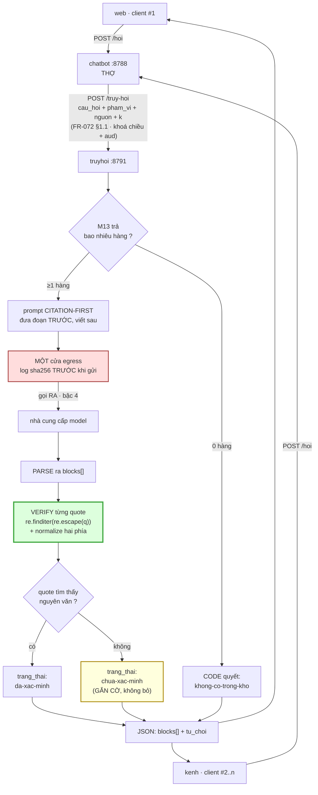
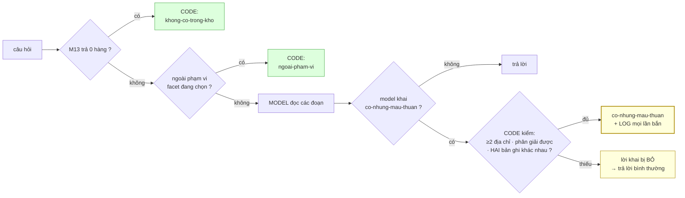
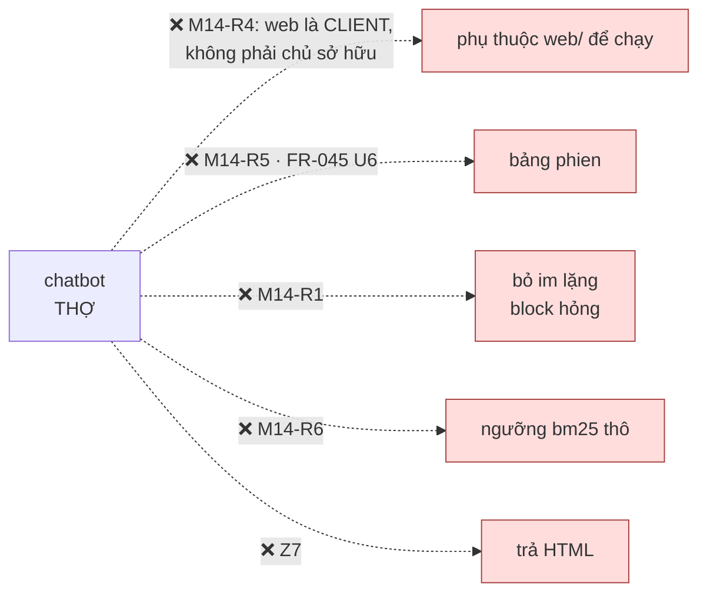
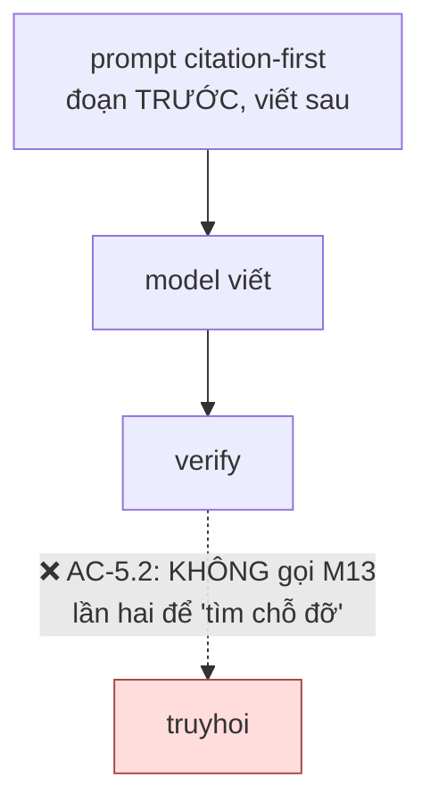

# M14_chatbot — diagram flow

> Khớp diagram tổng `04_system/`. M14 ở **THỢ** — và `spec_overview` đã đính chính
> một lần: bản đầu xếp nó vào LÕI, sai, vì luật vùng nói về **ai gọi RA ngoài**,
> không nói về ai gọi tới mình.

## 1 · Một lượt hỏi, đi hết vòng

**Ba chỗ đọc kỹ:**

`VF` (xanh) — **verify nằm SAU PARSE, TRƯỚC khi trả**. Đảo thứ tự thì không có gì
để verify. Đây là cổng tự cài, và nó bắt buộc vì mô phỏng format Anthropic **không**
thừa hưởng bảo đảm *"valid pointers"* của họ.

`CO` (vàng) — nhánh này **không bao giờ dẫn tới xoá**. Mọi repo khảo được đều
drop-im-lặng ở đúng chỗ này; ta gắn cờ. Số block vào phải **bằng** số block ra
(`M14-R1`).

`EG` (đỏ) — cùng luật egress với M12: một cửa, log trước khi gửi.

## 2 · Từ chối hai tầng — ai quyết cái gì

Hai nhánh xanh do **code** quyết — đo được, lặp lại được. Nhánh vàng do **model**
tự khai, và đó là chỗ **chỏi luật gốc**: model sở hữu thước đo của chính nó.

Không đảo quyết định của chủ dự án; thu hẹp bằng khối `K`. Code **không** phán được
nội dung có ngược nhau, nhưng chặn được lần từ chối **không trỏ vào đâu cả**. Nhánh
`BO` là chỗ lời khai thiếu bằng chứng bị bỏ — và nó **không** thành một lỗi, chỉ
thành một câu trả lời bình thường.

## 3 · Chiều CẤM

Mũi tên đầu là cái đắt nhất. Nó không hỏng bằng một exception — nó hỏng bằng việc
**kênh thứ hai tốn gấp đôi công kênh thứ nhất**, và lúc đó đã muộn. `M8.2 ≤ 20%` là
phép đo được đặt sẵn cho đúng chuyện đó.

## 4 · Vì sao KHÔNG có mũi tên M14 → M13 lần thứ hai

`research_summary` §11: **57%** citation kiểu generate-then-cite là
**post-rationalization** — model viết xong rồi đi tìm chỗ đỡ. Một lời gọi M13 thứ
hai *sau khi model đã viết* chính là cài đặt của cái 57% đó. Một lượt hỏi = **một**
lời gọi M13, **một** lời gọi model.
