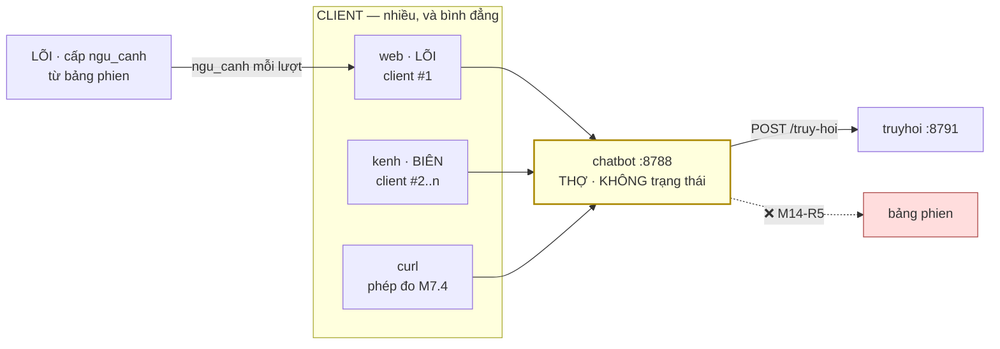
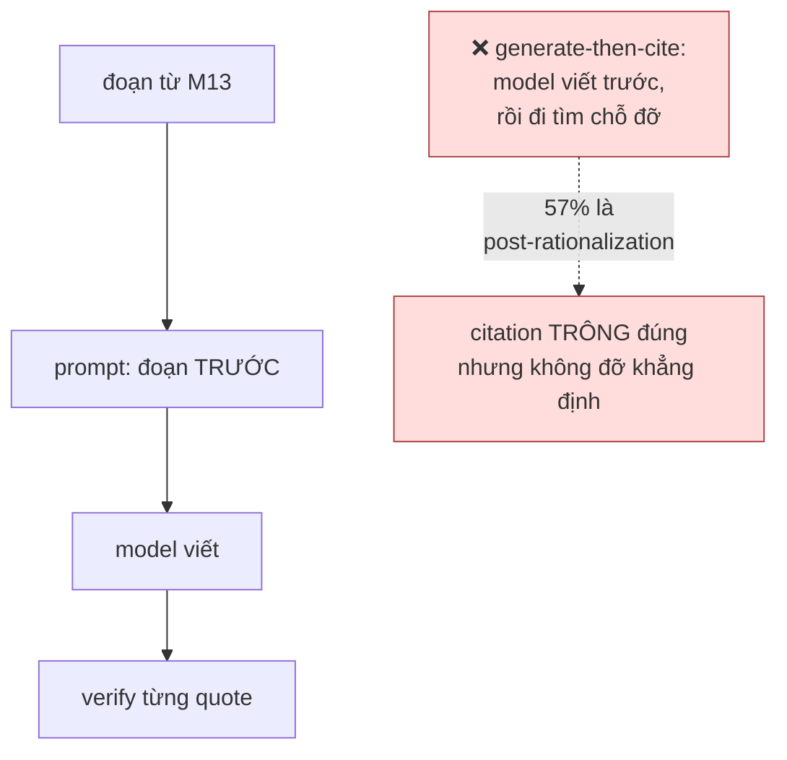

# M14_chatbot — model flow

> Entity vào/ra và contract. Hai nghĩa của "model" tách rõ: §1–§2 *model dữ liệu*,
> §3–§4 *model ngôn ngữ*.

## 1 · M14 là service, không phải một lớp trong web

**`curl` là một client hạng nhất**, không phải một mẹo kiểm thử — nó là **M7.4**.
Nếu M14 chỉ chạy được khi `web` chạy thì nó không phải service, và mọi kênh sau này
phải mang theo `web`.

## 2 · Contract với từng module

| với ai | contract | chiều |
|---|---|---|
| **M03_web** | `POST /hoi {cau_hoi, pham_vi, k, ngu_canh, bot\|nguon[]}` → `{blocks[], tu_choi}` | web → M14 |
| **M15_kenh** | **cùng một** endpoint, cùng hình dạng | kênh → M14 |
| **M13_truyhoi** | `POST /truy-hoi {cau_hoi, pham_vi, nguon, k}` → `{ket_qua[{doc_id, file, anchor, line_start, line_end, dia_chi, heading_path, body, nguon_van_ban, bm25}], so_ban_ghi_trong_pham_vi, tong}` — hình dạng **FR-072 §1.1**, một hợp đồng cho mọi client; `nguon` là khoá **bắt buộc** (`null` = cả kho, khai tường minh — AC-8.2); `body` đầy đủ là thứ verify `cited_text` so vào (M13-R4); mang khoá chiều `chatbot→truyhoi` + `x-aud: truyhoi` (ADR-08 Z9) | M14 → M13 |
| **M01_core** | đọc `dia-chi.json` như **file** để phân giải anchor | chỉ đọc |
| **M08_api** | **không gọi** — M14 không ghi kho, không đọc kho trực tiếp | — |

⚠️ **M15 dùng ĐÚNG endpoint của M03, không có endpoint riêng cho kênh.** Một
endpoint riêng cho Telegram là bước đầu của việc chatbot mọc hai bản. `M8.2` (kênh
thứ hai ≤ 20% công kênh thứ nhất) là phép đo bắt đúng chuyện này.

## 3 · Model ngôn ngữ — cùng luật M12

M14 gọi model ⇒ egress bậc 4. Định tuyến đọc từ **bảng khai**, không gõ tên model
trong mã (`M14-R7` không có — luật này là `AC-7.2`, và cổng là
`check_bang_khai_model.py` dùng chung khuôn với M12).

**Khác M12 ở một điểm**: M12 gửi **tài liệu** ra ngoài; M14 gửi **đoạn đã trích +
câu hỏi**. Cả hai là bậc 4, nhưng khối lượng và tần suất khác hẳn — M14 chạy mỗi
lượt hỏi. Nên trần thử lại và log của M14 sẽ dày hơn, và đó là lý do
`egress.jsonl` của nó là file **riêng**, không dùng chung với M12.

## 4 · Citation-first — và vì sao thứ tự là hợp đồng, không phải tối ưu

**57%** citation kiểu generate-then-cite là post-rationalization
(`research_summary` §11). Nên thứ tự *đoạn-trước-viết-sau* là **hợp đồng**, không
phải một cách viết prompt cho gọn. Và `AC-5.2` (không gọi M13 lần hai) là cách duy
nhất cưỡng chế nó được từ ngoài: một lời gọi M13 sau khi model đã viết **chính là**
cài đặt của cái 57% đó.

## 5 · Cái verify của ta BẢO ĐẢM, và cái nó KHÔNG

| kiểm được | KHÔNG kiểm được |
|---|---|
| địa chỉ có thật (phân giải được) | văn tại đó có **ủng hộ** khẳng định hay không |
| `cited_text` xuất hiện **nguyên văn** trong nguồn | quote có bị lấy **ngoài ngữ cảnh** hay không |
| block khẳng định có ≥1 citation | khẳng định có **đúng** hay không |
| từ chối `co-nhung-mau-thuan` trỏ vào hai bản ghi | hai bản ghi đó có **thật sự** mâu thuẫn |

`B-A6` đã ghi đúng giới hạn này: *"máy kiểm được địa chỉ có thật + văn tại đó chứa
từ khoá, KHÔNG kiểm được văn đó có ủng hộ khẳng định. Đừng khai quá vạch."*

Ghi lại ở đây vì M14 là chỗ dễ khai quá vạch nhất: một câu trả lời có mọi citation
xác minh **vẫn có thể sai**. Cờ `da-xac-minh` nghĩa là *"quote này có thật ở đó"*,
không nghĩa *"câu này đúng"*.

## 6 · Nợ hợp đồng

| nợ | trạng thái |
|---|---|
| hình dạng JSON của `ngu_canh` | `FR-045` khai **cột** `ngu_canh` nhưng chưa khai hình dạng. Phải chốt trước khi M14 nhận |
| bảng khai model dùng chung với M12 hay riêng | s7 quyết; hai bảng thì phải khớp, một bảng thì hai module dính một file |
| cờ `chua-xac-minh` hiện thế nào | AC của **M03**, không phải M14 |
| `co-nhung-mau-thuan` | không tiền lệ mã; log mọi lần bắn để ba tháng sau đếm được tỉ lệ sai |
