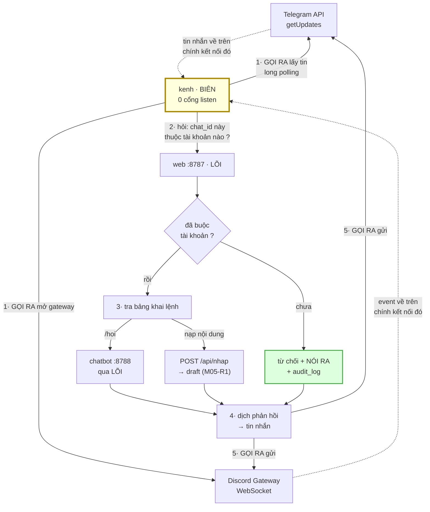
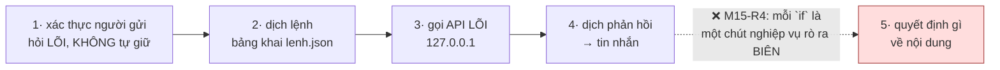
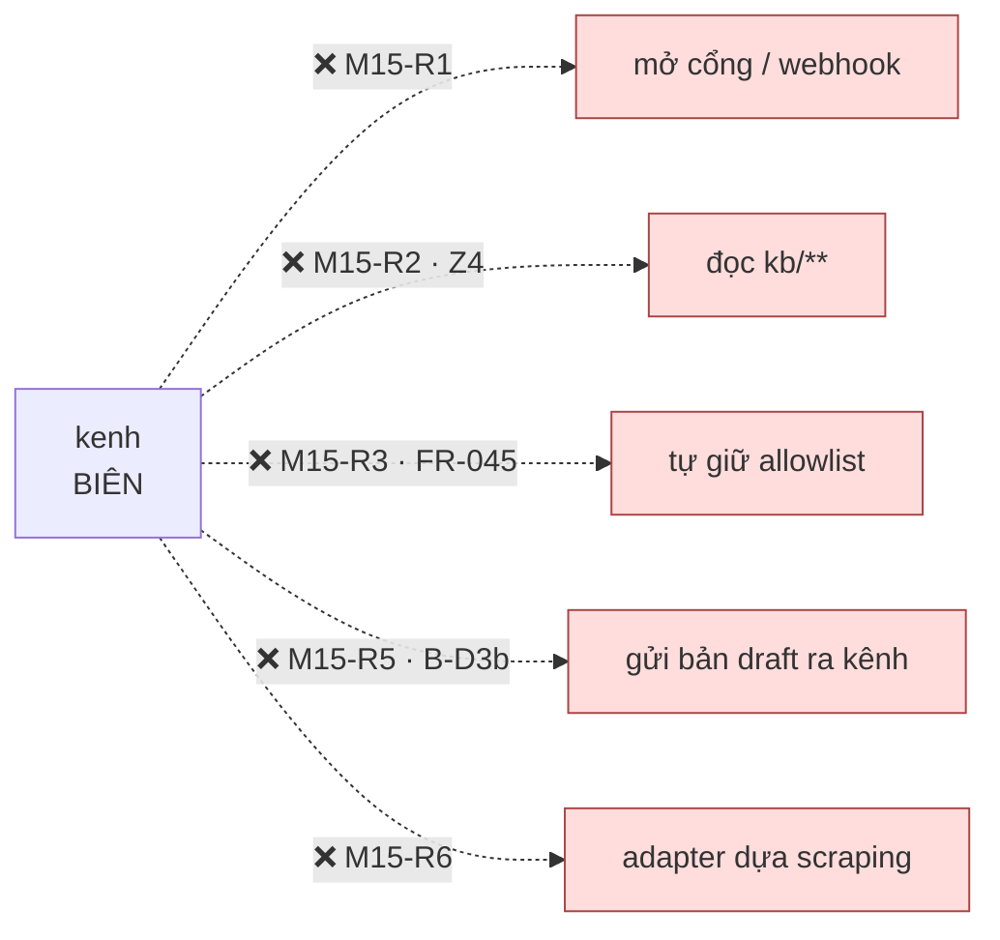
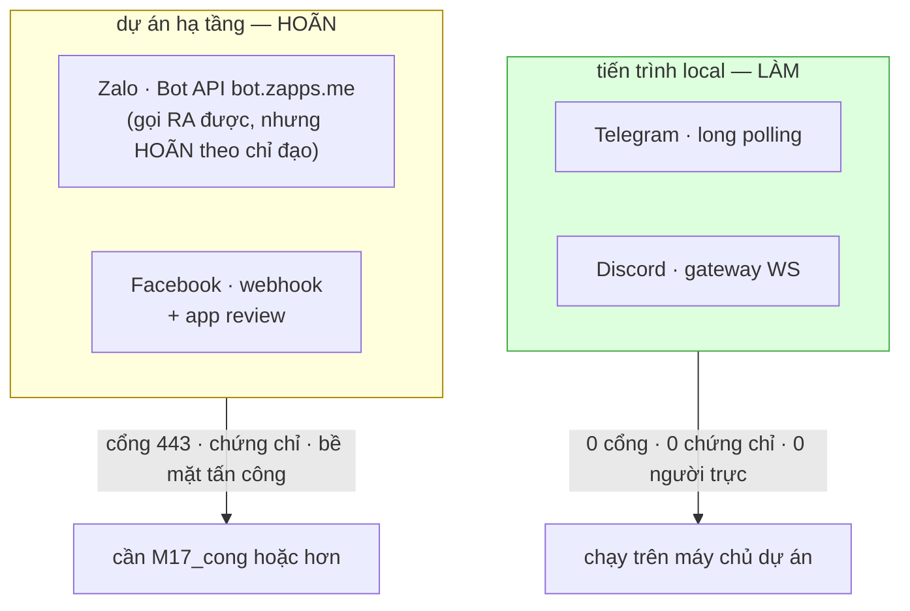

# M15_kenh — diagram flow

> Khớp diagram tổng `04_system/`. M15 ở **BIÊN**, và nó là vùng BIÊN duy nhất
> **không nghe gì** — nó **kéo**.

## 1 · Mọi mũi tên đều đi RA — không có mũi tên nào đi vào

**Nét liền = M15 chủ động gọi. Nét đứt = dữ liệu về trên chính kết nối M15 đã mở.**
Không có mũi tên nào bắt đầu từ Internet và kết thúc ở một cổng của M15 — đó là
`M15-R1`, và nó là toàn bộ lý do M15 là *một tiến trình local* thay vì *một dự án
hạ tầng*.

**Khối xanh** — từ chối phải **nói ra**, không im lặng bỏ tin. Im lặng thì người
gửi không biết mình chưa được buộc tài khoản, và họ gửi tiếp mãi.

## 2 · Bốn việc, và cái thứ năm bị cấm

Spec nói *"ba việc"*; sơ đồ vẽ **bốn khối** vì dịch-vào và dịch-ra là hai chiều của
cùng một việc dịch. Việc thứ năm là chỗ M15 dày lên, và nó dày **từng dòng một** nên
không ai thấy khoảnh khắc nó thành dày. `AC-2.3` (≤ 300 dòng/adapter) là phép đo cho
đúng chuyện đó.

## 3 · Chiều CẤM

Mũi tên thứ tư **không hoàn tác được**: tin nhắn đã gửi thì đã gửi. Một bản `draft`
ra Telegram là vượt toàn bộ vòng đời duyệt `M02 §2.2` bằng một đường khác.

## 4 · Vì sao hai kênh sau khác HẠNG, không khác độ khó

Zalo nằm ở nhóm hoãn **không** vì kỹ thuật — `research_summary` §10-6 xác nhận Bot
API chính thức đã tồn tại (`bot.zapps.me`, long-polling **giống Telegram**), tức nó
khớp mô hình chỉ-gọi-ra. Nó hoãn vì **chỉ đạo lượt 14**. Ghi rõ để lần sau không ai
đọc "hoãn" thành "không làm được".

Facebook thì khác hẳn: `research_summary` §3.3 — *"kéo bài về từ Facebook"* là
**tính năng không tồn tại**. Groups API gỡ khỏi mọi phiên bản **22/04/2024**; scraper
nguồn mở lớn nhất **tự nhận** không đáng tin cho production và ngừng push 6/2024.
