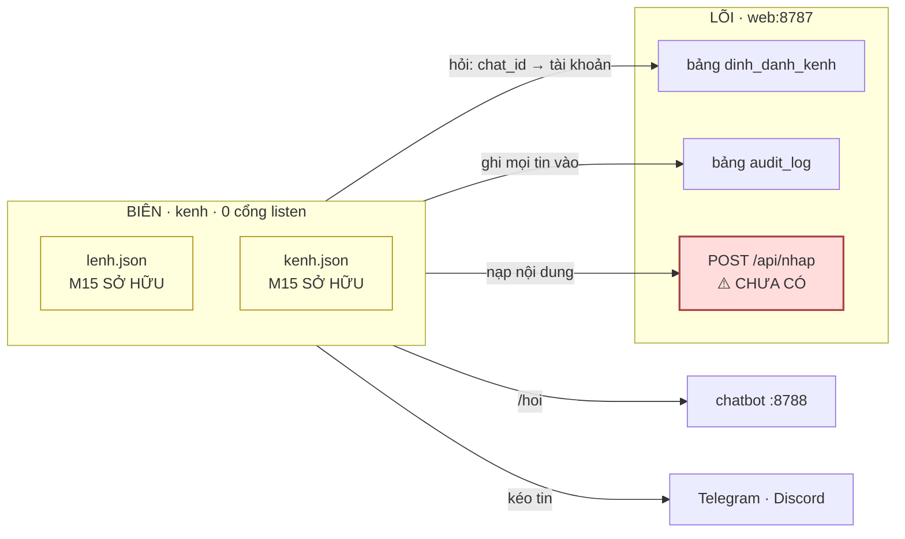
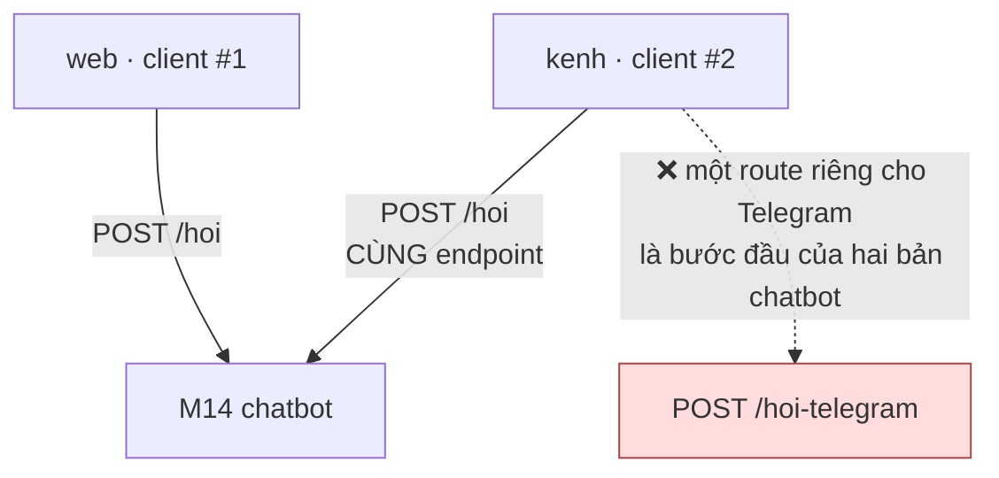

# M15_kenh — model flow

> Entity vào/ra và contract. M15 **không gọi model ngôn ngữ nào** — nó gọi M14 qua
> LÕI. File này chỉ nói về *model dữ liệu*.

## 1 · M15 không sở hữu gì, và không nhớ gì

**Khối đỏ là nợ chặn**: `POST /api/nhap` **chưa tồn tại**. Đường duy nhất đang có là
`POST /api/articles` (`taoBai`), và nó đặt `review_status: approved` **vô điều
kiện** — vì nó được thiết kế cho *người* viết. M15 dùng cửa đó là **vi phạm
`M05-R1`** trong khi mọi cổng vẫn xanh.

## 2 · Contract với từng module

| với ai | contract | chiều | trạng thái |
|---|---|---|---|
| **M14_chatbot** | `POST /hoi` — **cùng** endpoint M03 dùng | M15 → M14 | ✅ khai ở M14 |
| **M08_api** | `POST /api/nhap` → luôn `draft` | M15 → LÕI | ⚠️ **chưa có** |
| **M08_api** | "chat_id này thuộc tài khoản nào" | M15 → LÕI | ⚠️ **chưa có endpoint** |
| **M08_api** | ghi `audit_log` | M15 → LÕI | ⚠️ **chưa có endpoint** |
| nhà cung cấp kênh | Bot API / Gateway, **gọi RA** | M15 → Internet | ✅ nguồn chính thức |

**Ba nợ ở giữa bảng là hợp đồng với M08, không phải việc của M15.** Ghi ra vì nếu
s7 chia task M15 trước khi ba cửa đó có, người thi công sẽ đi vòng bằng
`POST /api/articles` — và đó là đường làm mất `M05-R1` mà trông như hợp lệ.

## 3 · M15 dùng ĐÚNG endpoint của M03 — không có route riêng cho kênh

`M8.2` (kênh thứ hai ≤ **20%** công kênh thứ nhất) là phép đo bắt đúng chuyện này.
Trượt nó gần như chắc chắn nghĩa là **chatbot đã mọc vào `web/`**, và chỗ sửa là
tách M14, **không** phải viết adapter gọn hơn.

## 4 · Mức tin KHÔNG đổi khi đi qua M15

| chặng | mức tin |
|---|---|
| kênh → M15 | **untrusted** |
| M15 → LÕI | tin **hình dạng**, không tin **nội dung** |
| LÕI → M15 → kênh | đã có người duyệt |

M15 dịch **hình dạng**, không nâng mức tin. Một tin nhắn thành một lời gọi API vẫn
là nội dung untrusted — và đó chính là lý do `gate.py:133` ép `draft` **vô điều
kiện** ở đầu bên kia, chứ không tin cờ mà người gọi gửi.

## 5 · Thứ M15 KHÔNG được quyết

| | ai quyết |
|---|---|
| nội dung có vào kho hay không | `gate.py` + người duyệt |
| `category` / `concepts` | **người**, gán sau (chỉ đạo lượt 13) |
| ai được dùng bot | LÕI, qua `dinh_danh_kenh` (`M15-R3`) |
| câu trả lời cho câu hỏi | M14 |
| bài nào được đẩy ra kênh | LÕI — và chỉ `approved` (`M15-R5`) |

Bảng này là định nghĩa của *"mỏng"*. M15 không có một quyết định nào về nội dung —
nếu nó có, thì nó không còn là adapter.

## 6 · Nợ hợp đồng

| nợ | vì sao chưa giải ở đây |
|---|---|
| **`POST /api/nhap`** | cửa ghi cho MÁY, luôn `draft`. Thuộc M08 ⇒ **FR tới M08**, không nới vào M15 |
| **endpoint tra `dinh_danh_kenh`** | `FR-045` khai bảng, chưa khai endpoint |
| **endpoint ghi `audit_log`** | `FR-045` U4 đòi ghi mọi tin; M15 không được ghi bảng trực tiếp |
| **rate-limit `ma_moi`** | lỗ đã ghi `security_baseline §8.1`; đi qua M15 vì việc buộc `chat_id ↔ account` xảy ra ở đây |
| **Zalo** | Bot API chính thức **đã tồn tại** (`bot.zapps.me`, long-polling) và khớp mô hình chỉ-gọi-ra. Hoãn theo **chỉ đạo**, không vì kỹ thuật — đừng đọc "hoãn" thành "không làm được" |
