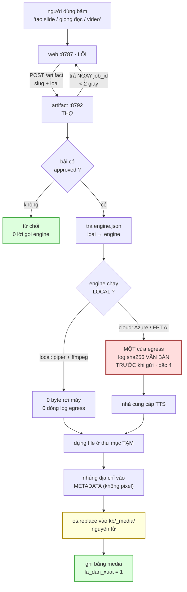
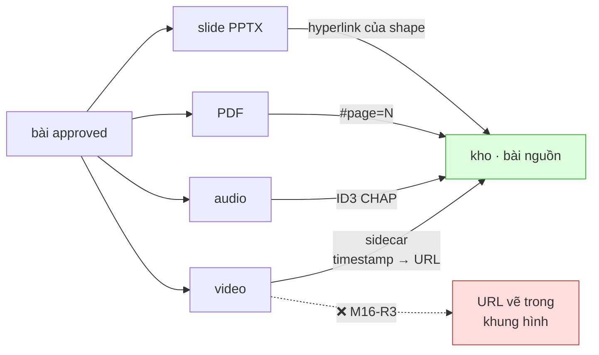
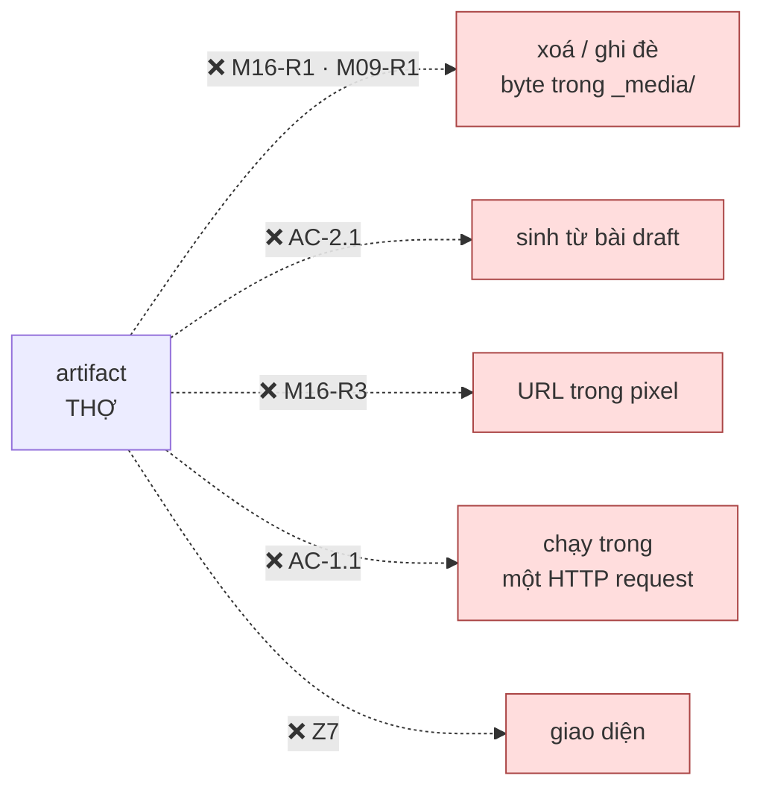
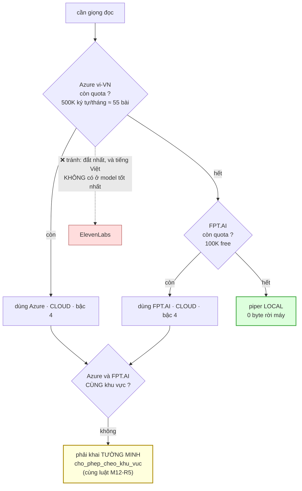

# M16_artifact — diagram flow

> Khớp diagram tổng `04_system/`. M16 ở **THỢ**, và nó là module duy nhất **GHI vào
> `kb/_media/`** — tức module duy nhất có cơ hội phá byte (`M09-R1`).

## 1 · Một job artifact, đi hết vòng

**Ba chỗ đọc kỹ:**

`EG` (đỏ) — TTS cloud gửi **toàn văn một bài** ra nước ngoài. Bậc 4, cùng hạng với
M12 gửi tài liệu nguyên liệu. Nhánh `LO` phải sinh **0** dòng log, và đó là cách nó
**chứng minh** không gửi gì (`M16-R4`).

`MV` (vàng) — dựng ở thư mục **tạm** rồi `os.replace` vào `_media/`. Không có bước
này thì một job bị giết giữa lúc ghi để lại **file nửa vời** trong kho hiện vật
(`AC-1.2`).

`DB` (xanh) — `la_dan_xuat = 1` là ranh giới cứu `M09-R1`: nó phân biệt artifact
(dựng lại được) với nguyên liệu người nạp (**không** dựng lại được).

## 2 · Quay ngược làm input — link ở metadata, theo từng loại

Bốn mũi tên về `K` là **lý do M16 tồn tại** thay vì chỉ xuất file: artifact phải
**quay ngược làm input**. Mũi tên đứt là cách làm mất điều đó — người xem không bấm
được, không copy được, và khi URL đổi thì phải **render lại cả video**.

## 3 · Chiều CẤM

Mũi tên đầu là mũi tên **không hoàn tác được** của cả dự án. M16 là module duy nhất
ghi vào `_media/`, nên nó là module duy nhất có cơ hội phá một PDF 30 trang mà người
dùng nạp bằng tay.

## 4 · Hai đường TTS — và vì sao thứ tự là dữ liệu, không phải ý kiến

Khối vàng là chỗ M16 **kế thừa** luật của M12: rơi dự phòng **chỉ trong cùng khu
vực pháp lý**, rơi chéo phải khai tường minh. Azure (Microsoft) và FPT.AI (Việt
Nam) gần như chắc chắn **khác** khu vực — nên đây không phải một ca lý thuyết, nó
là ca mặc định.

Khối xanh là đường **duy nhất** không gửi gì ra ngoài. Nó xếp cuối vì chất lượng,
nhưng nó là đường phải **luôn còn dùng được** — nếu cả hai cloud hết quota mà local
không chạy thì tính năng chết hẳn.
