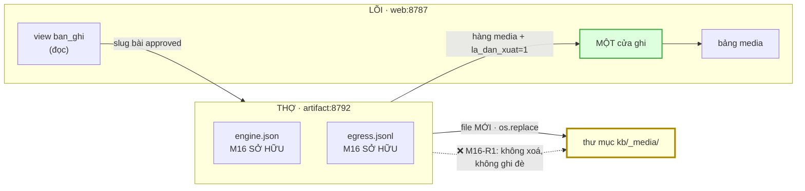

# M16_artifact — model flow

> Entity vào/ra và contract. §1–§2 *model dữ liệu*; §3 *model/engine sinh artifact*.

## 1 · M16 là module duy nhất ghi vào kho hiện vật



Mũi tên liền và mũi tên đứt trỏ vào **cùng một khối** — đó là điểm đặc biệt của M16:
nó **phải** ghi vào `_media/`, và đúng vì thế nó là module duy nhất có cơ hội phá
byte. Ranh giới không phải *"được chạm hay không"* mà là *"chỉ THÊM"*.

## 2 · Contract với từng module

| với ai | contract | chiều | trạng thái |
|---|---|---|---|
| **M08_api** | `GET /api/articles/<slug>` — chỉ bài `approved` | M16 → LÕI | ✅ đã có |
| **M08_api** | `POST /api/articles/media` — ghi hiện vật qua cửa ghi | M16 → LÕI | ✅ đã có (FR-036) |
| **M09_thuvien** | liên kết artifact ↔ bài nguồn | M16 → M09 | ⚠️ **chưa có cột** |
| **M01_core** | đọc `dia-chi.json` như **file** | chỉ đọc | ✅ |
| **M03_web** | trả `job_id` + trạng thái job | M16 → web | khai ở `ui_flow` |
| **M12/M13/M14** | **không gọi ai** — M16 không cần chưng cất hay truy hồi | — | — |

⚠️ **Nợ chặn**: bảng `media` có đúng **ba** cột (`sha256`, `byte`, `la_dan_xuat`) —
**không** có cột trỏ về `slug` bài nguồn. Đo 2026-09-01. Nên *"artifact này của bài
nào"* hiện **không lưu được ở tầng kho**; chỉ lưu được trong **metadata của file**.
Cần **FR tới M09** (owner của `media`), không nới vào M16.

## 3 · Engine — bảng khai, và giới hạn là thứ BẤT NGỜ

```
engine.json:
  loai            slide | slide-sua-duoc | giong-doc | video
    → engine · khu_vuc · du_phong · gioi_han · nguon_tai_lieu · ngay_tra
```

**`gioi_han` là cột quan trọng nhất**, và nó là cột duy nhất tồn tại vì một bất ngờ
đo được:

> **PPTX của Marp là ẢNH.** Chọn Marp cho một yêu cầu *"sửa được chữ"* thì file mở
> ra **trông đúng** và **không sửa được** — và người dùng phát hiện điều đó **sau
> khi** đã gửi cho người khác.

| loai | engine | giới hạn phải ghi trong bảng |
|---|---|---|
| slide | Marp CLI | PPTX là **ảnh** — không sửa được chữ |
| slide-sua-duoc | `pandoc` → pptx | bố cục kém hơn Marp |
| giong-doc | Azure → FPT.AI → piper | Azure/FPT.AI là **cloud** ⇒ bậc 4; piper là local |
| video | `ffmpeg concat` + TTS | dùng TTS local ⇒ **0 byte rời máy** |

> **ElevenLabs KHÔNG có trong bảng** — đắt nhất, và tiếng Việt **không có** ở model
> tốt nhất của họ. Ghi ra đây để lần sau không ai thêm nó vì "nghe hay nhất".

## 4 · Dự phòng TTS kế thừa luật khu vực của M12

`decisions.md` 2026-09-01 (`M12-R5`): dự phòng tự động **chỉ rơi trong cùng
`khu_vuc`**; rơi chéo phải khai tường minh từng dòng.

Azure (Microsoft) và FPT.AI (Việt Nam) gần như chắc chắn **khác** khu vực ⇒ đây
**không** phải một ca lý thuyết, nó là **ca mặc định** của M16. Nên bảng khai của
M16 sẽ có ít nhất một dòng `cho_phep_cheo_khu_vuc: true`, và dòng đó là một quyết
định phải có người ký, không phải một mặc định.

## 5 · Cái M16 KHÔNG quyết

| | ai quyết |
|---|---|
| bài nào được sinh artifact | người — và chỉ bài `approved` |
| nội dung slide/giọng đọc | engine, trong khuôn template ép |
| nhãn / `credibility_max` | người (`M01-R2`) |
| artifact cũ có bị dọn không | **không phải M16** (`M16-R1`) — một công cụ riêng, và nó chỉ an toàn nhờ `la_dan_xuat` |
| bố cục slide | template ép, không để LLM tự do |

Dòng cuối đáng nói: LLM sinh **outline JSON**, template **ép** ra Marp `.md`. Để LLM
tự viết Markdown slide thì bố cục đổi mỗi lần chạy, và không ai so được hai bản.

## 6 · Nợ hợp đồng

| nợ | vì sao chưa giải ở đây |
|---|---|
| **bảng `media` không có cột trỏ về `slug`** | ⚠️ **chặn `AC-4.1` ở tầng kho**. Cần FR tới M09 |
| **engine chưa chốt** | `research_summary` §10 tự khai M16 *"giữ mức phác"*; spec chốt **luật**, không chốt engine |
| **`khu_vuc` của từng nhà TTS chưa tra** | phải ghi **nguồn + ngày tra** trong bảng, cùng khuôn `kenh.json` của M15 |
| **ngưỡng corpus 10 bản ghi** | `AC-6.1` là **`soft`** — người chốt số |
| **ID3 CHAP và sidecar chưa có định dạng chốt** | `AC-4.1` cần một hình dạng cụ thể cho sidecar `timestamp → URL`; chưa chốt |
