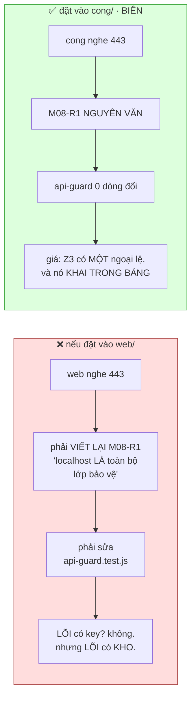
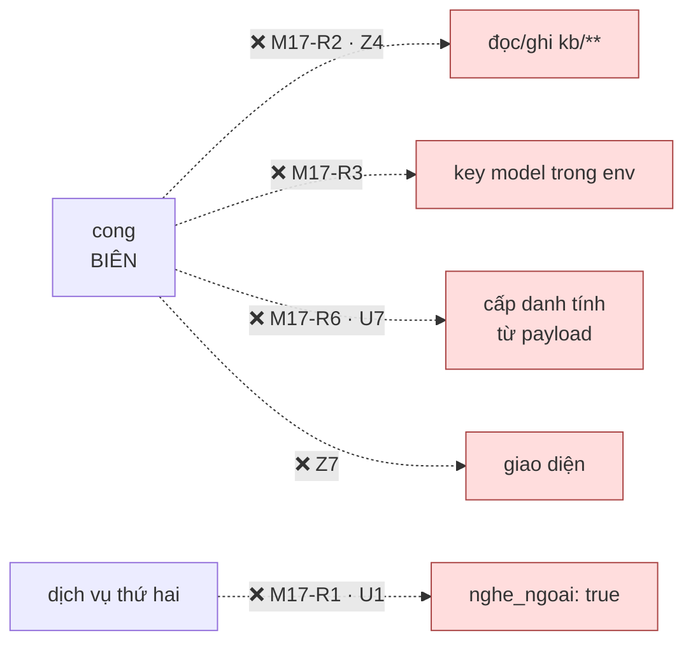
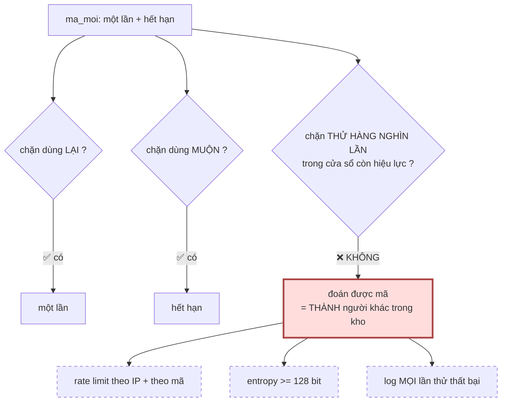

# M17_cong — diagram flow

> Khớp diagram tổng `04_system/`. M17 là **dịch vụ duy nhất của cả hệ nghe ngoài
> loopback** (`Z3`, ngoại lệ khai trong `dich-vu.json`).

## 1 · Đường vào duy nhất từ Internet

```mermaid
flowchart TD
    NET["Internet<br/>5 đồng nghiệp + chủ dự án"] -->|"HTTPS :443"| C["cong · BIÊN<br/>nghe_ngoai: true<br/>DUY NHẤT"]

    C --> RL{"rate limit<br/>theo IP + theo mã ?"}
    RL -->|"vượt"| B1["chặn + audit_log"]
    RL -->|"trong ngưỡng"| AU{"có phien hợp lệ ?"}

    AU -->|"không"| MM{"có ma_moi ?"}
    MM -->|"không"| B2["từ chối + audit_log"]
    MM -->|"có"| CK{"một lần ? chưa hết hạn ?<br/>entropy >= 128 bit ?"}
    CK -->|"trượt"| B3["từ chối + audit_log<br/>(KỂ CẢ thất bại)"]
    CK -->|"đạt"| BD["buộc chat_id ↔ account<br/>ghi dung_luc + audit_log"]
    BD --> AU

    AU -->|"có"| ID["thêm header danh tính<br/>SINH TỪ phien, KHÔNG từ payload"]
    ID --> FW["chuyển tiếp NGUYÊN VẸN<br/>127.0.0.1:8787"]
    FW --> W["web :8787 · LÕI<br/>vẫn bind 127.0.0.1"]

    style C fill:#fdd,stroke:#a44,stroke-width:3px
    style CK fill:#ffd,stroke:#a80,stroke-width:3px
    style B3 fill:#ffd,stroke:#a80,stroke-width:2px
    style W fill:#dfd,stroke:#4a4,stroke-width:2px
```

**Ba chỗ đọc kỹ:**

`C` (đỏ) — bề mặt tấn công lớn nhất của cả hệ. Nó **không có key model**, **không
chạm `kb/`**, **không có giao diện** — ba điều đó là cách giảm hậu quả của một lỗ ở
đây.

`CK` (vàng) — **nơi lỗi bảo mật sống**. Đoán được mã là **thành người khác trong
kho**. Ba phép kiểm: một lần · hết hạn · entropy ≥ 128 bit. `FR-045` khai hai phép
đầu; phép thứ ba là **lỗ FR không nêu**.

`B3` (vàng) — log **kể cả thất bại**. Nếu chỉ log lần thành công thì một cuộc dò
10.000 lần để lại **đúng một** dòng log: dòng của lần nó thành công.

`W` (xanh) — `web` **vẫn** bind `127.0.0.1`. Đó là toàn bộ lý do M17 tồn tại: nhờ nó
mà `M08-R1` và `api-guard.test.js` giữ **nguyên văn**.

## 2 · Vì sao đặt bề mặt Internet ở đây, không ở `web/`

Nhánh trái không sai về kỹ thuật — nó sai về **thứ bị đem ra đánh cược**: `web` là
nơi giữ **kho**. Nhánh phải đem ra đánh cược một tiến trình **không có kho, không có
khoá, không có giao diện**.

## 3 · Chiều CẤM

Mũi tên cuối là mũi tên **của tương lai**: nó không vi phạm hôm nay, nó vi phạm vào
ngày ai đó cần *"mở tạm một cổng cho webhook Zalo"*. `M17-R1` đếm được là **đúng
một**, nên lần thứ hai sẽ đỏ thay vì trôi qua.

## 4 · LỖ đã biết — rate limiting, và vì sao nó không phải chuyện đăng nhập

Nét đứt = **chưa thi công**, và chúng là **lỗ trong một `FR` ĐÃ DUYỆT** — `FR-045`
§3 gọi đúng tên chỗ nguy hiểm rồi bỏ sót phép chặn (`security_baseline §8.1`).

Hậu quả **không phải** *"đăng nhập sai"*: đoán được mã là đọc được toàn bộ tri thức
của người khác **và** hỏi chatbot dưới danh tính họ. Cần **FR bổ sung**, không phải
một dòng thêm vào M17.
