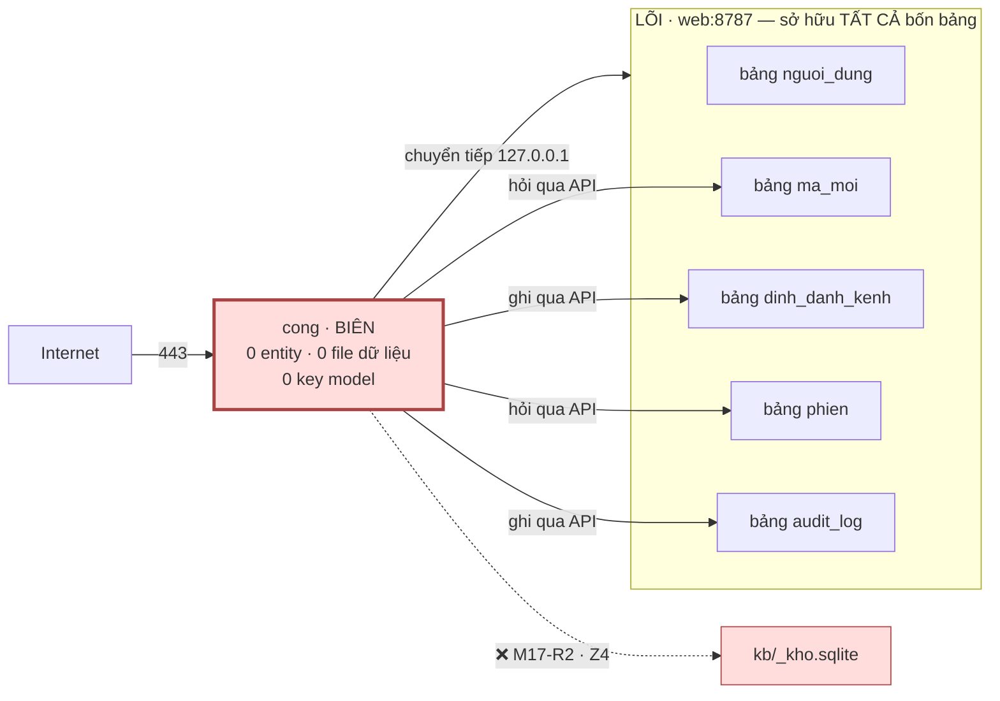
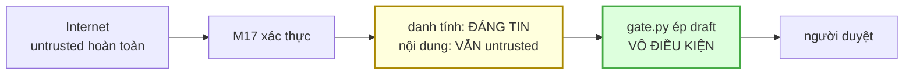

# M17_cong — model flow

> Entity vào/ra và contract. M17 **không gọi model ngôn ngữ nào** và **không có key
> model** (`M17-R3`) — file này chỉ nói về *model dữ liệu*.

## 1 · M17 không sở hữu gì — và đó là thiết kế

M17 là module duy nhất trong 16 **không có gì để mất**: không entity, không file dữ
liệu, không khoá. Một lỗ ở đây cho kẻ tấn công quyền **chuyển tiếp request** — không
cho quyền đọc kho, không cho hoá đơn model.

⚠️ **Bốn bảng KHÔNG nằm trong `kb/_kho.sqlite`** (`ADR-06`, 2026-09-02) — chúng ở
DB riêng của LÕI trong `web/`, vì `dung_lai_db.py` **xoá** `_kho.sqlite` rồi dựng
lại từ file, nên bảng nào không được export ra file thì **bị xoá sạch** mỗi lần
chạy lệnh đó. Dù ở đâu, `Z4` vẫn cấm BIÊN chạm dữ liệu trực tiếp. Nên **mọi** phép
tra đi qua API — và **chưa có endpoint nào**.

## 2 · Contract với từng module

| với ai | contract | chiều | trạng thái |
|---|---|---|---|
| **M08_api** | tra `phien` → danh tính | M17 → LÕI | ⚠️ **chưa có endpoint** |
| **M08_api** | tra + đánh dấu `ma_moi` | M17 → LÕI | ⚠️ **chưa có endpoint** |
| **M08_api** | ghi `audit_log` (mọi lần thử) | M17 → LÕI | ⚠️ **chưa có endpoint** |
| **M08_api** | ghi `dinh_danh_kenh` khi buộc | M17 → LÕI | ⚠️ **chưa có endpoint** |
| **M08_api** | chuyển tiếp request đã xác thực | M17 → LÕI | ✅ mọi endpoint hiện có |
| **M15_kenh** | **không gọi nhau** — hai BIÊN độc lập | — | — |
| **M01_core** | đọc `dich-vu.json` như **file** | chỉ đọc | ✅ |

**Bốn nợ đầu là hợp đồng với M08, không phải việc của M17.** `FR-045` khai **bốn
bảng** mà **không khai một endpoint nào** — đó là khoảng trống giữa "dữ liệu ở đâu"
và "ai chạm được nó thế nào".

## 3 · M17 và M15 đều ở BIÊN — nhưng ngược nhau hoàn toàn

| | M15_kenh | M17_cong |
|---|---|---|
| nhận tin bằng | **KÉO** (gọi RA) | **NGHE** (443) |
| `cong` trong bảng khai | `null` | **443** |
| `nghe_ngoai` | `false` | **true** — DUY NHẤT |
| hạng | tiến trình local | bề mặt Internet |
| sở hữu | 2 bảng khai | **0** |
| nếu bị chiếm | gửi tin nhắn rác | **chuyển tiếp request** dưới danh tính bịa — nếu `M17-R6` mất |

Hai module cùng vùng, ngược nhau ở **chiều kết nối** — và đó chính là ranh giới
`research_summary` §3.2 gọi là *"ranh giới quan trọng nhất của phần tích hợp"*: kéo
là một tiến trình, nghe là một dự án hạ tầng.

## 4 · M17 là chỗ DUY NHẤT mức tin đổi — và nó chỉ đổi MỘT vế

Khối vàng là chỗ dễ đọc sai nhất của cả kiến trúc: **xác thực xong không có nghĩa
nội dung đáng tin**. M17 trả lời *"request này của tài khoản nào"*, **không** trả lời
*"nội dung này có nên vào kho"*.

Đó là lý do khối xanh vẫn tồn tại: `gate.py:133` ép `draft` **vô điều kiện** kể cả
cho request đã xác thực — **một tài khoản thật vẫn có thể nạp rác**.

## 5 · Thứ M17 KHÔNG được quyết

| | ai quyết |
|---|---|
| nội dung có vào kho không | `gate.py` + người duyệt |
| ai được duyệt bài | **chỉ chủ dự án** (`B-B1`, không đổi một chữ) |
| một account có `vai` gì | LÕI — và cột `vai` **chưa ai đọc** |
| session chứa gì | LÕI (`FR-045` U6) |
| request đi tới endpoint nào | người gọi; M17 chuyển tiếp **nguyên vẹn** |

## 6 · Nợ hợp đồng

| nợ | vì sao chưa giải ở đây |
|---|---|
| **bốn endpoint của LÕI** | `FR-045` khai bảng, chưa khai endpoint ⇒ **FR tới M08** |
| **rate limit · entropy ≥128 bit · log thất bại** | ⚠️ **lỗ trong FR ĐÃ DUYỆT** (`security_baseline §8.1`) ⇒ **FR bổ sung** |
| **DDL bốn bảng** | ⚠️ **KHÔNG** vào `kho.schema.sql` (`ADR-06`) — DB riêng của LÕI trong `web/`; chưa có |
| **ngôn ngữ `cong/`** | chưa chọn (Caddy · nginx · tự viết); s4 quyết |
| **cột `vai` chưa ai đọc** | "phân quyền" là **một cột trống**; `M17-R6` là lớp duy nhất |
| **hồ sơ NĐ 356/2025 Điều 14** | `B-E5` đã kích hoạt từ khi có 5 tài khoản; hồ sơ DPIA + DPO chưa ai lập |

⚠️ **Sáu trong sáu nợ đều nằm ngoài M17.** Đây là module **phụ thuộc nhiều nhất và
tự làm được ít nhất** trong sáu module đợt hai. Ghi ra để s7 không xếp nó vào lịch
trước khi LÕI mở cửa — người thi công sẽ đọc DB trực tiếp cho nhanh, và đó là `Z4`
chết trong khi mọi cổng vẫn xanh.
