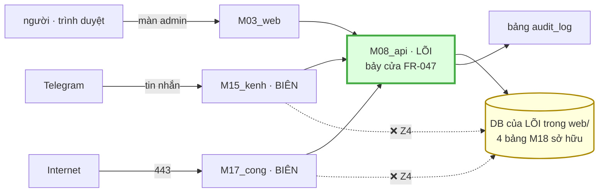

# M18_nguoidung — data flow

> ⚠️ Quy ước viết: tên **bảng / file / cột** luôn có một từ chỉ loại đứng trước —
> `check_ba` đọc dòng bảng mở đầu bằng một tên lowercase trong backtick như **một
> trường frontmatter** (M12 đã vấp, `WL-01K9W3S6M12`).

## 1 · M18 sở hữu bốn bảng và KHÔNG sở hữu file mã nào

| | tên | ai thi hành | ghi chú |
|---|---|---|---|
| **sở hữu** | bảng `nguoi_dung` | M08_api dựng DDL | `ten` là dữ liệu cá nhân (`B-E5`) |
| **sở hữu** | bảng `ma_moi` | M08_api | `ma` là **bí mật** |
| **sở hữu** | bảng `dinh_danh_kenh` | M08_api | `chat_id` là dữ liệu cá nhân |
| **sở hữu** | bảng `phien` | M08_api | M14 **không** chạm (`U6`) |
| **ghi qua** | bảng `audit_log` | M02_kb sở hữu | M18 chỉ khai *phải ghi gì* |
| **không sở hữu** | file mã nào | — | module NGANG |

**Cả bốn nằm trong DB RIÊNG của LÕI ở `web/`** — **không** ở `kb/_kho.sqlite`
(`ADR-06`). `dung_lai_db.py:139-140` **xoá** `_kho.sqlite` rồi dựng lại từ file,
nên một bảng dữ liệu **gốc** nằm trong đó là một bảng **bị xoá sạch** mỗi lần
chạy lệnh đó.

## 2 · Ba đường vào, và cả ba đi qua M08

**Không có đường thứ tư.** `Z4` cấm BIÊN chạm dữ liệu, nên M15 và M17 hỏi qua
API. Nếu ngày nào một trong hai đọc DB trực tiếp cho nhanh, `Z4` **chết trong khi
mọi cổng vẫn xanh** — đó là lý do `M17 workflow.md §4` liệt nó thành một chỗ DỪNG.

## 3 · Ai đọc gì

| module | đọc bảng nào | để làm gì |
|---|---|---|
| **M08_api** | cả bốn | thi hành bảy cửa `C1–C7` (`FR-047`) |
| **M17_cong** | `phien` · `ma_moi` · `dinh_danh_kenh` | xác thực request từ Internet |
| **M15_kenh** | `dinh_danh_kenh` · `ma_moi` | `chat_id` → `nguoi_dung_id` |
| **M12_chungcat** | `nguoi_dung` (gián tiếp) | `AC-1.5` — `nguoi_dung_id` do **LÕI gán**, không do payload |
| **M14_chatbot** | **không đọc bảng nào** | `phien` do LÕI giữ (`U6`) |
| **M03_web** | cả bốn qua API | màn admin |

⚠️ **M14 là hàng đáng đọc kỹ nhất.** Nó là module **cần** ngữ cảnh phiên nhất, và
là module **cấm** chạm bảng phiên. Ngữ cảnh đi tới nó như một **tham số** do LÕI
truyền xuống, không như một phép tra. Lý do: M14 ở **THỢ** — vùng duy nhất giữ
khoá model và gọi ra Internet, tức vùng phải giả định sẽ có prompt injection.

## 4 · Ra — ba bảng xuất file, hai bảng không

| bảng | ra file? | vì sao |
|---|---|---|
| bảng `nguoi_dung` | **có** | mất là phải dựng lại thủ công từng tài khoản |
| bảng `dinh_danh_kenh` | **có** | mất là mọi người phải buộc lại `chat_id` |
| bảng `ma_moi` | **không** | mã một-lần đã hết hạn — khôi phục = khôi phục rác |
| bảng `phien` | **không** | khôi phục xong vẫn phải đăng nhập lại |

Dấu vết của hai bảng không-xuất sống trong bảng `audit_log` dưới dạng **sự kiện**,
không phải **trạng thái** — và **không kèm giá trị bí mật** (`M18-R2`).

## 5 · Nợ hợp đồng

| nợ | trạng thái |
|---|---|
| **DDL bốn bảng** | chưa có — `FR-047` mở cửa, chưa ai viết DDL |
| **bảy cửa `C1–C7`** | `FR-047` **đã duyệt**, chưa thi công |
| **`check_db_dung_cho.py`** | ✅ **đã cài** (T08-10) — nhưng vế export còn **5 dòng BỎ QUA** vì bảng chưa tồn tại |
| **màn admin** | **chưa có wireframe** — s5 chưa chạy; `screens: []` |
| **rate limit · entropy · log thất bại** | ⚠️ lỗ trong `FR-045` đã duyệt ⇒ **FR riêng** |
| **quyết định "vai nào làm được gì"** | ⚠️ cột `vai` trống ⇒ **FR riêng** |

⚠️ **Sáu nợ, và bốn trong sáu nằm ngoài M18** — đúng hình dạng một module NGANG.
Hai nợ còn lại (`FR` rate-limit và `FR` phân vai) là **quyết định của chủ dự án**,
không phải task.
