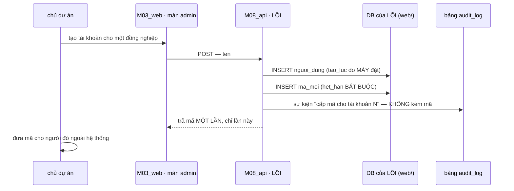
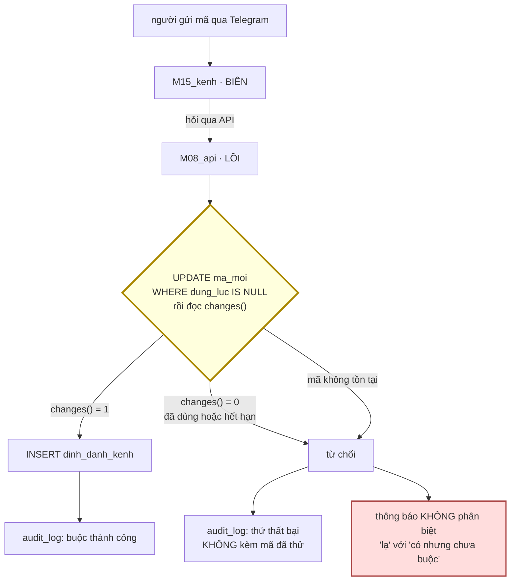
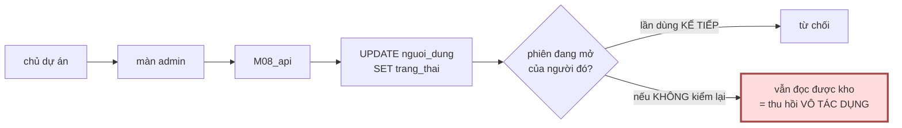

# M18_nguoidung — diagram flow

> Ba luồng: **mời một người** · **buộc một kênh** · **thu hồi**.
> Cả ba đi qua `M08_api`; không luồng nào chạm DB trực tiếp từ BIÊN (`Z4`).

## 1 · Mời một người — từ lúc sinh mã tới lúc có account dùng được

⚠️ **Mã trả về đúng một lần và không lưu lại chỗ nào đọc được.** Nếu màn admin
xem lại được mã đã cấp, thì mã thôi là bí mật một-lần — nó thành một bí mật nằm
trong một màn hình. `M18-R2` canh vế log; vế màn hình là `AC-2.1`.

## 2 · Buộc một kênh — và cả ba nhánh đều ghi audit

⚠️ **Khối vàng là chỗ dễ viết sai nhất của cả module.** Cách trực giác là
`SELECT` xem mã còn không, rồi `UPDATE`. Hai câu, và giữa hai câu có một khe —
`M18-R1`. Với 5 tài khoản khe đó gần như không bao giờ trúng, **và đó chính là
điều làm nó nguy hiểm**: nó chỉ đỏ vào đúng ngày hai người bấm cùng lúc.

⚠️ **Khối đỏ không phải chuyện lịch sự.** Hai thông báo phân biệt được biến cửa
này thành một **phép đếm tài khoản** cho người lạ (`AC-3.3`, `FR-047 V6`).

## 3 · Thu hồi — và vế người ta hay quên

⚠️ **Khối đỏ là một CVE có thật, không phải một lo xa.**
`CVE-2026-44560` (Open WebUI) ghi thẳng: *"revocation is ineffective"* — quyền bị
gỡ ở bảng, nhưng **ba trong năm** đường code không kiểm lại, nên phiên đang mở
vẫn đọc được. Nên phép đo của `AC-1.3` phải là **hành vi sau khi thu hồi**, không
phải *"cột đã đổi giá trị"*.

Và `NguoiDung` là **gốc** của ba bảng kia (`model_flow §1`), nên "thu hồi" là đổi
**một cột** mà hiệu lực phải lan tới **ba** bảng. Đó là hình dạng lỗi mà một
cổng đo-cột sẽ **xanh oan**.

## 4 · Ba luồng, một chỗ nghẽn cố ý

Cả ba đều đi qua `M08_api`. Đó không phải tiện tay — nó là `Z4`: **BIÊN không
chạm dữ liệu**. `M15_kenh` và `M17_cong` đều ở BIÊN, và đường đi vòng của chúng
(đọc DB trực tiếp cho nhanh) là thứ **không cổng nào hiện có bắt được** — nên
`M17 workflow.md §4` liệt nó thành một chỗ **DỪNG** thay vì một cổng.
