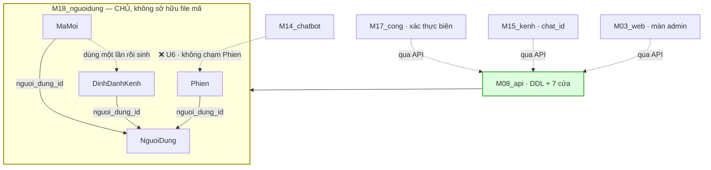

# M18_nguoidung — model flow

> Entity vào/ra và contract. M18 **không gọi model ngôn ngữ nào** và **không có
> khoá model** — nó là module NGANG ở LÕI. File này nói về *model dữ liệu*.

## 1 · Bốn entity, một chủ, nhiều người dùng

`NguoiDung` là **gốc**; ba bảng còn lại trỏ về nó. Nên thu hồi một tài khoản là
một phép đổi **một cột** — nhưng hiệu lực của nó phải lan tới **ba** bảng, và đó
chính là chỗ `AC-1.3` canh.

## 2 · Contract với từng module

| với ai | contract | chiều | trạng thái |
|---|---|---|---|
| **M08_api** | DDL bốn bảng trong DB của LÕI ở `web/` | M18 khai → M08 thi hành | ⚠️ chưa có |
| **M08_api** | bảy cửa `C1–C7` | `FR-047` | ⚠️ **đã duyệt**, chưa thi công |
| **M17_cong** | tra `phien` · tra + đánh dấu `ma_moi` · ghi `dinh_danh_kenh` | qua API | ⚠️ chờ `FR-047` |
| **M15_kenh** | `chat_id` → `nguoi_dung_id` | qua API | ⚠️ chờ `FR-047` |
| **M12_chungcat** | `nguoi_dung_id` do **LÕI gán**, không do payload | `AC-1.5` + `M12-R7` | ✅ đã khai |
| **M14_chatbot** | **không** đọc/ghi `phien` — nhận ngữ cảnh làm **tham số** | `FR-045 U6` | ✅ đã khai |
| **M03_web** | màn admin: mời · thu hồi · xem ai buộc kênh nào | qua API | ⚠️ **chưa có wireframe** |
| **M02_kb** | ghi `audit_log` (M02 sở hữu bảng đó) | qua API | ✅ bảng đã có |

**Bốn trong tám contract đang chờ `FR-047`.** M18 không tự thi công được cái nào
— đúng bản chất module NGANG.

## 3 · Chỗ M19_baihoc sẽ cắm vào — và vì sao ghi ở đây

`M14_chatbot AC-8.4` (đã viết, G6A xanh) hứa:

> *"**MỘT chokepoint.** Đúng **một** hàm giải `bot → tập doc_id`"*

Hôm nay **không có bảng nào đứng sau lời hứa đó**. `AC-8.1` nhận `bot` hoặc
`nguon[]`; `AC-8.5` **cấm** nhận tập nguồn từ caller ⇒ **server phải giải được
`bot` thành một tập** — bằng cái gì thì M14 không nói, vì không có gì để nói.

`BaiHoc` chính là cái bảng đó. `FR-048` đã khai entity `BaiHoc` với
`owner: M19_baihoc`, `status: planned` — **không** có `06_modules/M19_baihoc/`.

⚠️ Ghi ở model_flow của **M18** chứ không phải chỗ khác vì: khi M19 thi công, nó
sẽ cần biết *"bot này của ai"* — tức nó sẽ trỏ về `NguoiDung`. Quan hệ đó nằm
trong hình vẽ §1 dưới dạng một cạnh **chưa tồn tại**, và ghi ra đây là cách nó
không bị dựng thành một bảng người-dùng **thứ hai**.

## 4 · Thứ M18 KHÔNG quyết

| | ai quyết |
|---|---|
| ai được duyệt bài | **chỉ chủ dự án** (`B-B1`, không đổi một chữ) |
| một `vai` làm được gì | **chưa ai** — cột trống, cần FR (`M18-R3`) |
| nội dung có vào kho không | `gate.py` + người duyệt |
| ngưỡng rate limit | **chưa ai** — lỗ trong `FR-045`, cần FR |
| `.db` nằm ở đâu | `ADR-06` — backend của phần nào ở đâu thì `.db` ở đó |
| bảng `audit_log` có cột gì | M02_kb sở hữu |

## 5 · Nợ hợp đồng

| nợ | vì sao chưa giải ở đây |
|---|---|
| **DDL + bảy cửa** | `FR-047` đã duyệt, chưa thi công — việc của s8 |
| **màn admin** | **s5 chưa chạy** cho màn này; `screens: []`, không tự bịa số SCR |
| **FR rate limit + entropy + log thất bại** | lỗ trong FR ĐÃ DUYỆT ⇒ FR riêng, không gộp |
| **FR "vai nào làm được gì"** | quyết định của chủ dự án |
| **`check_db_dung_cho.py`** | ✅ đã cài (T08-10) ⇒ `M08-R6` có răng cho vế **chỗ ở**; vế export chờ bảng thật |
| **hồ sơ NĐ 356/2025 Điều 14** | `B-E5` đã kích hoạt từ khi có 5 tài khoản; DPIA + DPO chưa ai lập |

⚠️ **Nợ cuối nặng thêm sau `ADR-06`**: ba bảng nay **xuất ra file trong git**, và
hai trong ba mang dữ liệu cá nhân (`ten`, `chat_id`). Trong git **local** thì
không khác gì DB. `git push` đầu tiên thì đó là **chuyển dữ liệu cá nhân ra
ngoài**. Không chặn gì hôm nay — chặn **lần push đầu tiên**.
